# 计算机网络

## 第一章 概述

计算机网络由若干节点和链路组成，是一些互相连接的、自洽的、计算机集合

### 交换

电路交换：建立连接$\rightarrow$通话$\rightarrow$释放连接，通话时间内两用户始终占用资源，传输效率低

分组交换：采用存储转发技术，整块数据为报文message，加上首部header，变为分组packet，路由器负责转发分组。优点高效、灵活、迅速、可靠

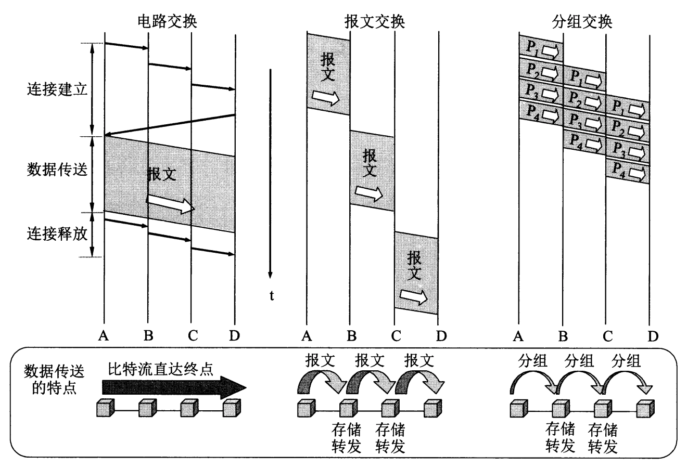

### 分类

网络作用范围分类：

1. WAN：几十到几千千米，广域网
2. MAN：5~50km，城域网
3. LAN：1km左右，局域网
4. PAN：10m左右，个人网

网络使用者分类：

1. 公用网

2. 专用网

   

### 性能

1. 比特率(bit rate)：单位bit/s，额定速率标准速率，$K=10^{3},M=10^{6}$

2. 带宽(bandwidth)：第一种是包含的各种不同频率成分所占据频率范围，第二种是最高数据率

3. 吞吐量(throughput)：某个网络单位时间内实际数据通过量

4. 时延(delay)：

   1. 发送时延：发送第一帧到最后一帧数据的时间，$发送时延=\frac{数据帧长度(bit)}{发送速率(bit/s)}$

   2. 传播时延：电磁波传播时间，$传播时延 = \frac{信道长度(m)}{电磁波速率(m/s)}$

   3. 处理时延

   4. 排队时延：路由器输入队列中等待的时间

      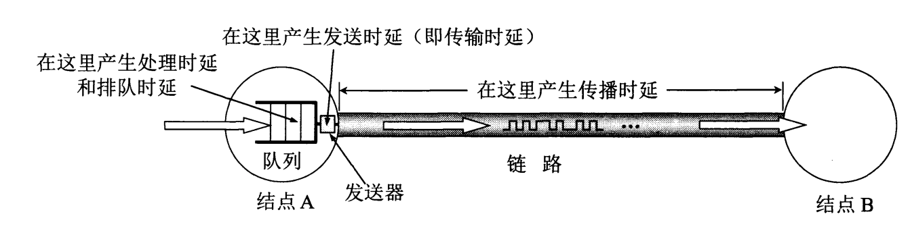

5. 时延带宽积(BDP)：$BDP=传播时延*带宽$

6. 往返时间(RTT)：确认消息走一圈的时间

7. 利用率(U)：$D=\frac{D_0}{1-U}$


### 协议

#### 要素：

1. 语法：数据与控制信息的结构格式
2. 语义：需要发出何种控制信息，如何响应
3. 同步：事件顺序的说明

#### 分层

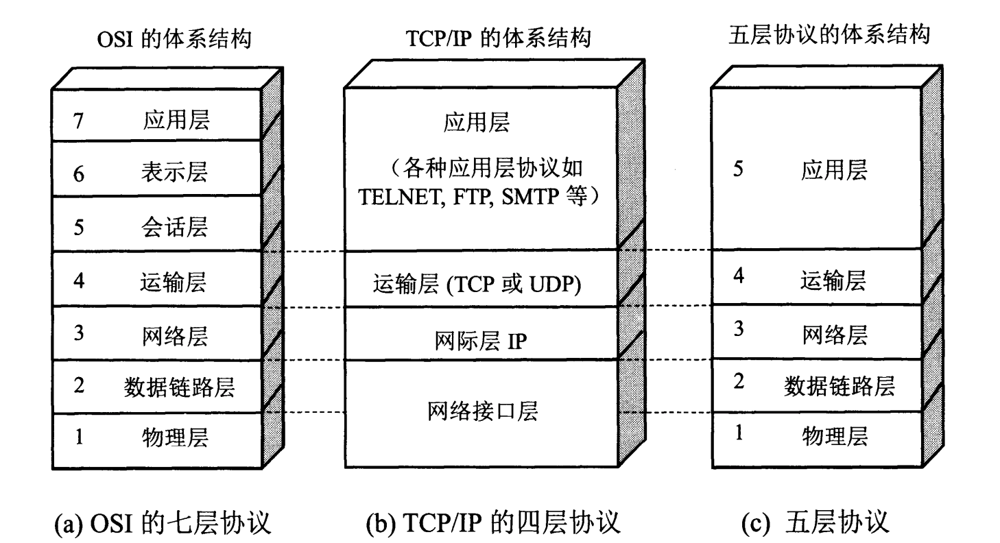

1. 应用层：进程交互规则，DNS，HTTP，SMTP，应用层数据单元为报文
2. 运输层：通用的数据运送
   1. TCP：面向连接，可靠的，传输单位报文段
   2. UDP：无连接的，尽最大努力的，传输单位用户数据报
3. 网络层：为不同主机服务，把数据封装为分组或包传送，IP协议
4. 数据链路层：单位为帧，包括数据信息和控制信息
5. 物理层：单位为比特

#### 特点

下面的协议对上面的实体透明

同一系统相邻两层实体进行交互的地方成为服务访问点SAP


## 第二章 物理层

### 物理层概念

1. 机械特性：形状尺寸、引脚排列等
2. 电气特性：各电缆线上电压范围
3. 功能特性：某条线上某个电压的定义
4. 过程特性：不同功能可能出现的事件顺序

### 信道

#### 种类

单向通信：又称单工

双向交替通信：又称半双工

双向同时通信：又称全双工

#### 极限容量

限制码元传输速率因素：

1. 信号能通过频率范围：高频分量往往不能通过低频分量，产生码间串扰，信道频带越宽，通过的高频信号分量越多，传输速率越高。理想低通信道$最大传输率=2Hlog_2V$，H为信道带宽，V为信号电平级数（信号状态数）
2. 信噪比：信号平均功率与噪声平均功率比，记为S/N，单位dB。
   $信噪比(db为单位)=10log_{10}{S/N}$。
   信道极限传输速率$C=Wlog_{2}{(1+S/N)}$，W为信道带宽(单位Hz)，S为信道内所传信号平均功率，N为信道内高斯噪声功率。公式意义：只要信息传输速率低于信道极限传输速率，就存在某种方法实现无差错传输。

### 调制

基带调制：称为编码

载波调制：带通调制，频率调高

调幅、调频、调相

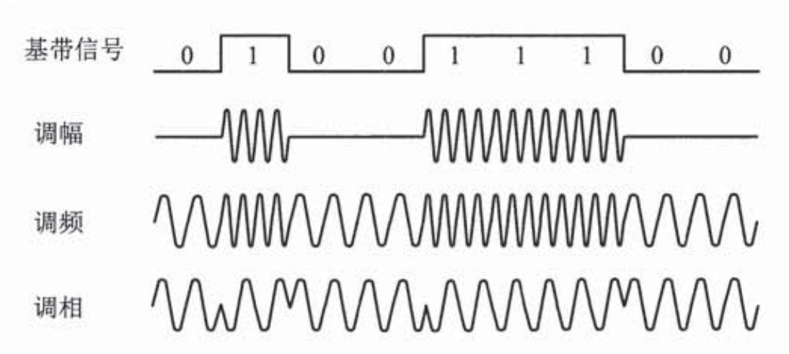

### 常用编码方式

1. 不归零制：正电平为1，负电平为0
2. 归零制：正脉冲为1，负脉冲为0
3. 曼彻斯特编码：周期中心向上跳为0，向下跳为0，
4. 差分曼彻斯特：边界有跳变为0，无跳变为1

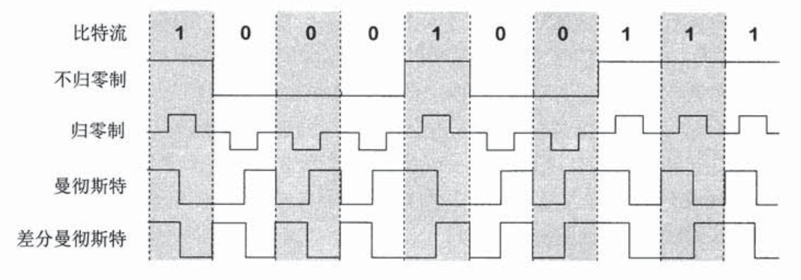

### 传输媒体


#### 导引型（有线）

##### 双绞线

模拟传输和数字传输皆可以，模拟传输需要放大器，数字传输需要中继器

| 绞合线类别  |  带宽  |         线缆特点          |               典型应用               |
| :---------: | :----: | :-----------------------: | :----------------------------------: |
|      3      | 16MHz  |       2对4芯双绞线        | 模拟电话；曾用于传统以太网(10Mbit/s) |
|      4      | 20MHz  |       4对8芯双绞线        |           曾用于令牌局域网           |
|      5      | 100MHz |    与4类相比增加绞合度    |     传输速率不超过100Mbit/s应用      |
| 5E（超5类） | 125MHz |     与5类相比衰减更小     |      传输速率不超过1Gbit/s应用       |
|      6      | 250MHz | 与5类相比改善了串扰等性能 |       传输速率高于1Gbit/s应用        |
|      7      | 600MHz |      使用屏蔽双绞线       |       传输速率高于10Gbit/s应用       |

##### 同轴电缆

较好抗干扰，传输高速率数据，一般用在小区有线电视网

##### 光缆

光纤通信就是用光导纤维传递光脉冲进行通信。中间纤芯有较高折射率，发生全发射。

存在多条不同角度入射光线在一条光纤传输，称为多模光纤。光脉冲在多模光纤传输时会展宽，只适用于近距离传输。

光纤减小到一个波长的宽度，则不会发生反射，成为单模光纤。

特点：

1. 传输损耗小，中继距离长，远距离传输很经济
2. 抗干扰性能好
3. 无串音干扰保密性好
4. 体积小重量轻，但两段光纤连接需要精密设备


#### 非导引型（无线）

##### 短波通信

短波通信主要靠电离层的反射，电离层不稳定衰落现象和电离层反射的多径效应使质量较差

##### 微波通信

无线电微波频率为300MHz~300GHz，直线传播，可穿透电离层，传播距离受限需要接力。

地面微波接力通信优点：

1. 频率高，频段范围款，所以通信信道容量大
2. 传输质量较高
3. 建设投资少，见效快

地面微波接力通信缺点：

1. 相邻站必须直视
2. 有时候会受到恶劣气候影响
3. 隐蔽性保密性差
4. 大量中继站维护需要人力物力

卫星通信具有较大时延，一般为270ms

ISM频段是免费使用频段5.725GHz~5.825GHz

### 信道复用

发送端使用复用器，信号共享信道通信，接收端使用分用器分离信号

#### 频分复用FDM

所有用户在同样时间占用不同频率带宽资源

用户增多，总带宽变大

#### 时分复用TDM

所有用户在不同时间占用同样频带宽度，更适合数字信号传播

用户增多，时隙宽度减少

STDM：统计时分复用，可以提高信道利用率，每一帧的时隙数少于用户数。按需动态分配时隙，用户有数据的时候才发送给集中器的输入缓存。为了区别不同用户，在每个时隙前有开销。

TDM和STDM帧都是物理层比特流中划分的帧，不是数据链路的帧

#### 波分复用WDM

n路光载波，经调制器将波长变为相隔nm级别的波长上，再经复用器整合，传输，最终到分用器，再分为不同波长，再经过解调器还原

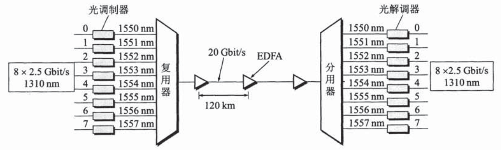

#### 码分复用CDM

特点：各用户挑选不同码型，用户间不造成干扰，且有很强抗干扰能力。

每一个比特时间划分为m个码片，通常为64或128个。

每个站指定m个bit的码片序列，发送1则发送整个序列，发送0则发送序列的反码。因此实际发送的数据提高到原来的m倍，频带宽度也需要扩大到m倍。这种扩频方式称为直接序列扩频(DSSS)，另外一种叫做跳频扩频FHSS。

每一个站的码片序列要正交，即规格化内积$S \bullet T = \frac{1}{m}\sum_{i=1}^mS_iT_i=0$

接收方收到各种信号时，对每个信号用发送方的码片序列进行内积

1. 与其他的信号内积为0
2. 与正确发送方S发出来的码片序列做内积为1
3. 与发送的反码做内积为-1


### 数字传输系统

#### 同步光纤网SONET

同步网络的各级时钟都来自精确地主时钟，为光纤传输定义了同步传输速率等级结构

SONET为基础制定了SDH，SDH与SONET基本速率不同，SDH帧结构以STM-1，更高等级是用N个STM-1复用组成STM-N


### 宽带接入

#### ADSL

非对称数字用户线(Asymmetric Digital Subscriber Line)：用数字技术对现有的模拟通话用户线进行改造。用户线本身信号频率可到1MHz，低频段留给原来的电话使用，高频段留给用户上网使用。ADSL不对称是下行（ISP到用户）带宽大于上行带宽（用户到ISP）

ADSL传输距离取决于数据率、用户线线径、信噪比：用户线越细，传输率越高，信噪比越小，则距离越短。

我国目前方案是离散多音调DMT调制技术，把40kHz~1.1MHz分为子信道，25个用于上行，249个用于下行。使用不同载波进行调制，ADSL启动时调制解调器测试可用频率等情况，选择合适调制方案，不能保证固定传输率，

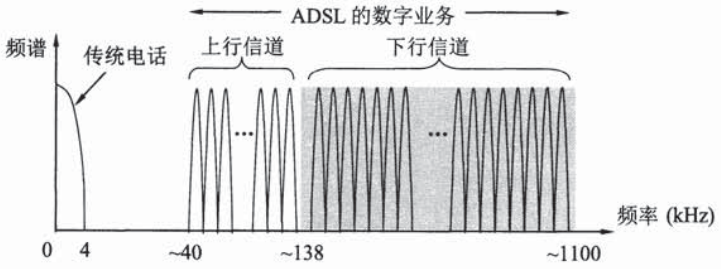

ADSL组成：数字用户线接入复用器DSLAM、用户线、用户家中设施。

DSLAM包括ADSL调制解调器（又称为接入端接单元ATU），ATU-C（远端局使用），ATU-R（用户使用） 。用户电话通过电话分离器和ATU-R，经用户线到端局，在通过分离器连到电话交换机

二代ADSL改进：

1. 提高调制效率得到更高数据率
2. 采用无缝速率自适应技术SRA
3. 改善线路质量评测和远程故障定位

#### HFC网

光纤同轴混合网：在目前覆盖面很广的有线电视网基础上开发的居民宽带接入网

光纤从头端连接到光纤结点，光信号转换为电信号，然后通过同轴电缆送到每家。

电缆和电视机之间有机顶盒，机顶盒与PC之间需要电缆调制解调器，一段同轴电缆用户共享传输率，而ADSL用户独享

#### FTTx

光纤到户：光纤进入家门后，才从光信号转换为电信号

光纤干线与用户之间，需要光配线网ODN，无源光配线网称为PON。光线路终端OLT是连接到光纤干线的终端设备，OLT把收到的下行数据发往无源1:N光分路器，然后向所有用户端光网络单元ONU，ONU在哪就是FTT哪，ONU到PC一般使用5类线以太网连接

光配线网采用波分复用，上行下行采用不同波长

PON种类：

1. 以太网无源光网络(EPON)：链路层使用以太网协议
2. 吉比特无源光网络(GPON)：采用通用封装方法GEM


## 第三章 数据链路层

### 点对点信道：一对一

#### 概念

链路：一段连续物理线路（无线或有线）

链路+协议硬件软件=数据链路

#### 主要步骤

1. A把网络层的包添加首部和尾部封装成帧
2. A将帧发给B
3. B验收发现无差错，从帧中提取出包交给网络层，否则丢弃帧

#### 封装成帧

帧的首尾部负责帧定界，且包含控制信息

MTU——数据部分长度上限

SOH(0x01)在最前面表示开始，EOT(0x04)在最后表示结束

#### 透明传输

在数据中出现SOH和EOT时前面加入ESC(0x1B)，进行转义，接收端识别到需要将其删除。方法称为字节填充。

#### 查错检测

##### 比特差错

误码率BER

**循环冗余检验方法CRC**：

1. 把数据划分为组，每组k比特，CRC运算在组后添加n为冗余码，k+n构成帧发送出去。
2. n为冗余码可以用模2运算（加法时不进位，减法转换为加法），在一组M后面加上n个0，除以收发方商定好的n+1位数字P，得出商是Q，余数为R(n位)，余数即为FCS(帧检验序列)，
3. CRC再检验发来的k+n位数字能否整除P，能整除正确，不能为错误。

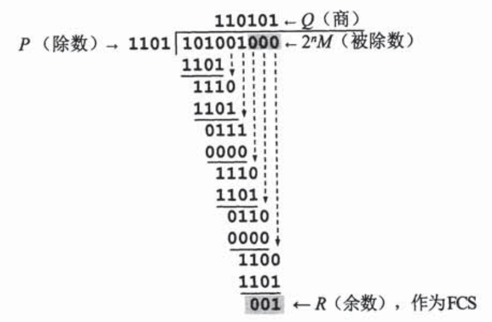

生成多项式$P(X) = X^3 + X^2 + 1$表示1101

##### 滑动窗口协议

###### 思想

发送一次就确认一次使信道利用率过低，利用率$U=\frac{T_D}{T_D+RTT+T_A}$其中：

1. $T_d$：发送数据帧时间
2. RTT：往返时间
3. $T_A$：发送应答帧时间

允许发送方连续发送多个帧，通过滑动窗口实现流量控制，每个帧有序列号，发送和接收方都需要维护一个序列号的队列

###### 原理

发送方：每当得到一个包，将其组成帧发出，窗口上边界+1；每当窗口下边界的帧被确认时下边界+1

接收方：窗口内序列号代表可以接受的帧。收到帧序列号等于下边界时，接收并上交，返回确认帧，窗口向前移动1个位置。帧序列号落在窗口外就丢弃。

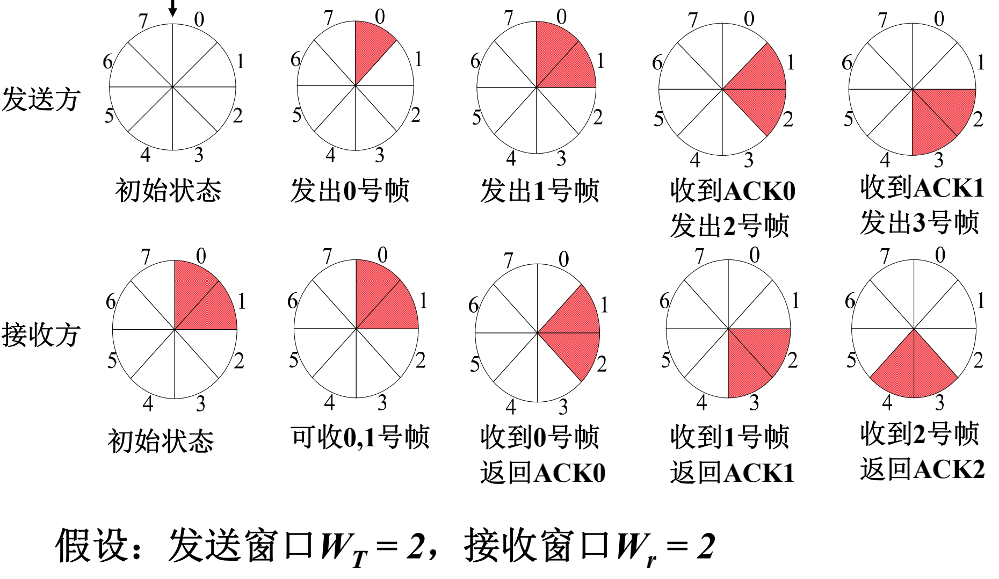

窗口大小都为1的时候即为ARQ协议（发出后接到确认才能继续发送）

###### 错误处理

1. 后退N帧：出错帧后的帧丢弃，从出错帧开始重新发送，实际上错误时接受窗口宽度为1
2. 选择性重传：接收到出错帧时发送一个否定确认NAK。可以让发送方不用等到全体发送完后就重新发送出错数据，接收方要能缓冲窗口内接收到的帧

##### 传输差错

发送三个帧  **[#1]-[#2]-[#3]**

帧丢失：**[#1]-[#3]**

帧重复：**[#1]-[#2]-[#2]-[#3]**

帧失序：**[#1]-[#3]-[#2]**

策略：通信质量好的网络，数据链路层不执行确认重传，由上层如运输层来改正；通信质量差的网络由数据链路层确认重传


### 点对点协议PPP

PPPoE是为宽带上网的主机使用的链路层协议

#### 特点：

用户计算机与ISP通信时的数据链路层协议，特点有：

1. 简单：检验失败直接丢弃，具体操作交给TCP
2. 封装成帧：帧定界
3. 透明性
4. 多种网络层协议：在同一物理链路上支持多种网络层协议
5. 多种类型链路：串并行，同异步，高低速，电or光，静态动态
6. 差错检测
7. 检测连接状态：异常需要报错，链路恢复需要识别，精度为几分钟
8. 最大传送单元：MTU，超过就要丢弃
9. 网络层地址协商：使两个网络层实体协商，配置彼此地址
10. 数据压缩协商：PPP并不要求将数据压缩算法标准化

**PPP不支持多点线路（主站轮流和从站通信），PPP只支持全双工链路**

#### 组成

1. 一个将IP数据报封装到串行链路的方法。PPP支持面向比特的同步链路，也支持异步无奇偶校验8比特数据
2. 一个建立、配置、测试数据链路的控制协议LCP
3. 一套网络控制协议NCP，其中每一个协议支持不同的网络层

#### 帧格式

首尾是标志字段F(0x7E)，连续两帧中间件只需要一个标志字段

信息部分不超过1500字节

| 协议字段 |        协议         |
| :------: | :-----------------: |
|  0x0021  |      IP数据报       |
|  0xC021  | 链路控制协议LCP数据 |
|  0x8021  |   网络层控制数据    |

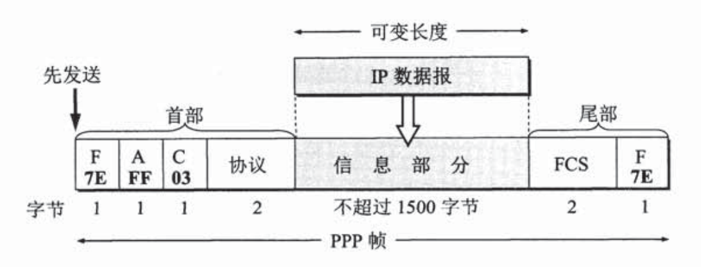


#### 字节填充

1. 转义符为0x7D
2. 信息段出现的每一个0x7E转换为(0x7D,0x5E)
3. 信息段出现的每一个0x7D转换为(0x7D,0x5D)
4. 出现小于0x20的控制字符，则需要转义，如0x03变为(0x7D,0x23)

#### 零比特填充

对信息段发送时，连续扫描到5个1就补一位0，保证不会出现6个1，因此没有0x7E。接受时遇到5个1就删除后面的0，可无损恢复。

#### 工作状态


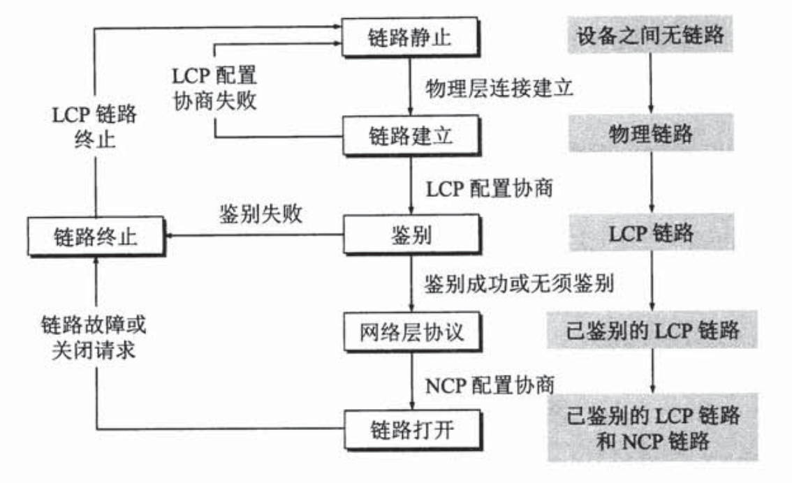

##### 配置LCP

物理层建立连接后，发送一个PPP的LCP协议类型帧，可以有三种信息段的一种：

1. 配置确认帧：所有选项都接受
2. 配置否认帧：所有选项都理解但不能接受
3. 配置拒绝帧：有选项无法识别或不能接受，需要协商

网络层协议：根据不同协议交换网络控制分组


### 广播信道：一对多

#### 局域网数据链路

局域网跨越了数据链路层和物理层

###### 信道：

1. 静态划分：代价高，不适合局域网
2. 动态媒体接入控制：多点接入，并非在通信时固定分配给用户有两类：
   1. 随机接入：所有用户随机发送信息，需要解决碰撞的网络协议
   2. 受控接入：有分散控制的令牌环算法，还有集中控制的轮询算法

###### IEEE802.2划分层次

1. 逻辑链路控制LLC(logical link control):现在已经消失了
2. 媒体接入控制MAC(medium access control)

###### 适配器

适配器和局域网之间用电缆或双绞线串行传输，适配器和计算机通过主板I/O并行传输，需要缓存数据。需要安装驱动程序，使适配器知道什么时候把多长数据块发送到局域网或接受。接受发送的时候使用中断通知CPU

#### CSMA/CD协议

发送数据帧的时候在首部写明接收站地址，接收方ROM中存储的硬件地址匹配的时候才会接收。

1. 以太网采用灵活无连接方式，不需编号和确认，为不可靠交付。
2. 以太网发送数据采用曼彻斯特编码

要点：

1. 多点接入：总线型网络
2. 载波监听
3. 碰撞检测：信号电压增大说明出现冲突导致信号叠加

CSMA/CD下以太网只能半双工通信。

以太网使用截断二进制指数算法确定重传时机：

1. 退避时间为争用期$2\tau$,单位为发送1bit所需时间，也可以直接用比特表示
2. 从$[0,1,\dots,(2^k-1)]$中随机取出一个数，记为r。重传推后时间为r倍争用期。k为$Min[重传次数,10]$
3. 重传次数大于16的时候直接丢弃

以太网规定最少帧长为64字节，为了防止碰撞产生的时延内本应叠加的出错帧被识别。

##### 强化碰撞：

一旦发生碰撞，还需要发干扰信号，让所有用户都知道已经发生了碰撞，总共占用时间是A发送到遇到B消息后回来的时间$T_B$+发送强碰撞信号的时间$T_J$+强碰撞信号在内端到端跑的时间$\tau$。

以太网规定帧最小间隔9.6微秒，为了接受的缓存来得及处理

发送过程：

1. 准备发送，获得分组，加上以太网的首尾部，组装成帧放入缓存
2. 检测信道，轮询检测，在最小间隔时间保持空闲则发送，并保留一份在本地
3. 边发送边监听，发送成功回到1，未成功则采用退避算法随机时间发送，再检测


#### 集线器星形拓扑

虽然星型但仍是总线网络，集线器负责收集转发，配备多个接口，一般由少量容错或管理能力。

#### 以太网信道利用率

发送一帧所需要用的平均时间：争用期$n \times 2\tau$、发送数据时间$T_0$、端到端延时$\tau$

定义参数$a=\frac{\tau}{T_0}$，让其尽可能小，若做到无争用期，极限信道利用率为$\frac{1}{1+a}$

#### 以太网MAC层

##### 硬件地址

MAC地址（硬件地址），固定在适配器ROM中的48位全球地址，

生产时高24位为OUI，IEEE规定地址第一字节最低位为I/G位，0表示单站地址，1位组地址。第一字节倒数第二位为G/L位，为0是全球管理，为1是本地管理

单播：一对一，收到的地址与本MAC地址相同

广播：一对全体，发送给局域网所有站点，全1地址

多播：一对多，发送给部分站点


##### MAC帧格式


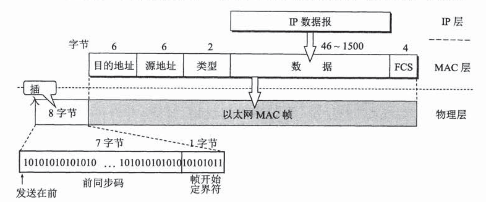

| 类型字段 |   协议   |
| :------: | :------: |
|  0x0800  | IP数据报 |
|  0x8137  |   IPX    |

发送方把一个帧发送完后，不发其他码元，电压不变化。采用曼彻斯特编码很容易找到结束位置，根据位置反推4字节可以找到结束的数据段位置。

IP层首段标记总长度，用总长度减去当前接受的数据段长度，得到填充长度，从尾部舍弃这些即可

插入在前的是为了让适配器时钟与比特流同步，最后字节的11位定界符，代表数据到来。

FCS检验范围不包括前面插入的8字节

无效帧：

1. 帧的长度不是整数个字节
2. 用FCS校验出查错
3. 数据段长度不在46~1500

IEEE802.3规定类型字段大于0x0600，表示协议类型，小于0x0600默认为LLC帧，表示数据段长度


### 扩展的以太网

#### 物理拓展

使用光纤拓展主机和集线器之间的距离，用主干集线器把各个系以太网连起来，形成更大的一个碰撞域，任意时刻只有一个站在发送数据。多个系统之间若适配器吞吐量不同，则连在一起工作，吞吐量为最低吞吐量。

#### 数据链路层拓展

##### 交换式集线器（以太网交换机）特点：

1. 多接口网桥
2. 直接与主机或以太网相连，工作在全双工状态，并行发送
3. 连入的主机独占传输媒体，无碰撞传输数据
4. 有存储器进行缓存
5. 即插即拔，用硬件转发，内部帧交换表通过自学习算法建立

##### 自学习功能：

发送数据时将MAC地址和接口写入，别的数据如果要发送给某个MAC地址，现在表中查找，如果有对应地址直接发送，没有则广播。设置失效时间过期被删除。核心思想：A从1接口发出数据，A接收数据也先从A口接收。

生成树协议STP：一台主机到其他主机路径是无环路树状结构

##### 星型以太网

全双工，但是帧结构还是以太网的帧结构

#### 虚拟局域网

VLAN:由一些局域网网段构成的与物理位置无关的逻辑组，且这些网段有同样的需求。每一个VLAN帧会标记该发往哪个VLAN

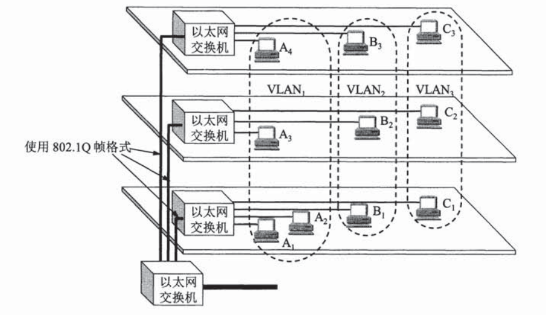

0x8100为802.1Q类型标记，CFI为规范格式指示符，最后是VLAN标识符


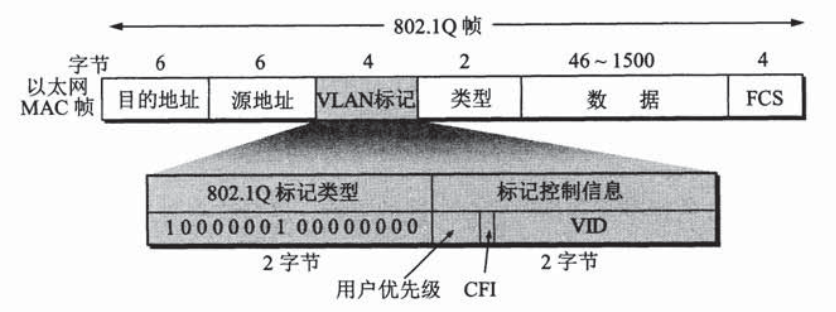

#### 高速以太网

传输速率上升，帧发送时间变短，为了让参数a更小($a=\frac{\tau}{T_0}$)，只能减小$\tau$。减小$\tau$要么剪短网段距离，要么增大争用的时候发送的字节

载波延伸：最短帧长64，增大争用期，MAC帧需要补足到512字节

10GE比特网只在全双工模式运行，不存在争用期


## 第四章 网络层

### 两种思路：

1. 面向连接的方式，建立虚电路，所有分组都从固定路径中发送到明确地址，提供可靠传输
2. 向上只提供简单灵活的、无连接的、尽最大努力交付的数据报服务。包在网络中由不同途径到达，不提供可靠传输，网络层上层保证可靠性。

|      对比方面      |               虚电路服务               |              数据报服务              |
| :----------------: | :------------------------------------: | :----------------------------------: |
|        思路        |           可靠通信由网络保证           |          可靠通信由主机保证          |
|      连接建立      |                 必须有                 |                不需要                |
|      终点地址      | 仅在连接建立阶段用，每个分组用虚电路号 |       每个分组都有完整终点地址       |
|      分组转发      |      同一虚电路分组按同一路由转发      |       每个分组独立选择路由转发       |
|      结点故障      |    所有通过故障结点虚电路都不能工作    | 故障结点丢失分组，一些路由可能会变化 |
|      分组顺序      |          总按发送顺序到达终点          |             不一定按顺序             |
| 差错处理和流量控制 |       可由网络负责也可由主机负责       |           只能用户主机负责           |


### 网际协议IP

#### 虚拟互联网络

强调逻辑网络，使性能各异的网络连起来看起来像是一个网络，屏蔽了下层的异构细节，用户用虚拟互联可认为所有计算机接入的是一个网络

#### 分类的IP地址及表示方法

IP地址划分为若干类，第一个字段网络号，第二个主机号，网络号在整个网络里面唯一，主机号他的网络范围内要唯一。

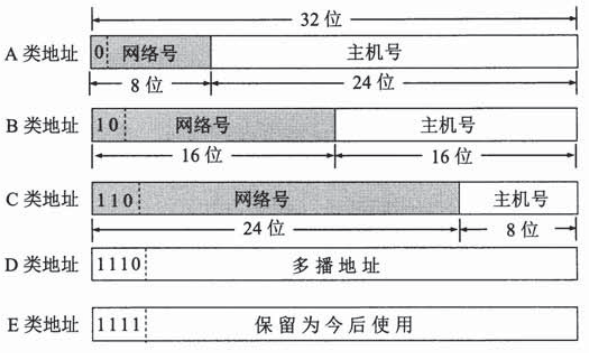

A、B、C类地址都是单播地址，前面1~3位为类别位

D类地址为多播

E类地址考虑以后用

**IP地址用点分十进制记法**

#### 常用三类IP地址

##### A类：

网络号1个字节，第一位固定为0，可指派号是$2^7-2$个，全0表示“本网络”，127作为本地软件的环回测试地址。

主机号占3个字节，最大主机数$2^{24}-2$个，全0主机号表示该IP地址是"本主机"所连接到的单个网络地址，全1主机号表示该网络上的所有主机

##### B类：

地址128.0.0.0不指派，可以指派的B类最小网络地址是128.1.0.0。因此B类地址可指派的网络数为$2^{14}-1$，主机$2^{16}-2$。

##### C类：

地址192.0.0.0不指派，可以指派的C类最小网络地址是192.0.1.0
，因此C类地址可指派的网络总数是$2^{21}-1$，每一个C类地址的最大主机数是$2^8-2$。

| 网络号 |       主机号       | 源地址 | 目的地址使用 |                 代表意思                 |
| :----: | :----------------: | :----: | :----------: | :--------------------------------------: |
|   0    |         0          |  可以  |     不可     |             在本网络上本主机             |
|   0    |      host-id       |  可以  |     不可     |        在本网络上某台主机host-id         |
|  全1   |        全1         |  不可  |     可以     | 只在本网络进行广播（各路由器均不可转发） |
| net-id |        全1         |  不可  |     可以     |        对net-id上所有主机进行广播        |
|  127   | 非全0或全1的任何数 |  可以  |     可以     |           用于本地软件环回测试           |


##### 特点：

1. 网络和主机分开，路由器只需要记住网络号，缩小了占用内存和查找时间
2. 联入两个网络的需要两个IP地址，比如路由器
3. 转发器和网桥连接的若干局域网还是同一个网络，具有同样的网络号
4. 所有网络平等

表示一个局域网的网络号：可以直接将主机号变为0再加网络号变成IP地址

无编号网络（无名网络）：两个路由器直接相连的时候可以不分配IP地址，来节省IP资源

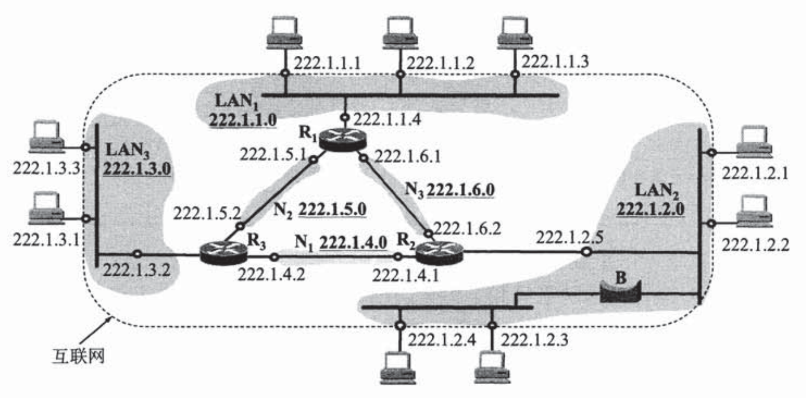

#### IP地址与硬件地址

1. IP层及以上抽象的互联网上只能看到IP地址，数据报里只有目的IP和源IP地址
2. 路由器只根据目的站IP地址网络号进行选择
3. 局域网链路层只能看见MAC帧，每一次转发都有丢掉之前帧的目的物理地址和源物理地址，然后添加新的地址字段
4. IP层抽象互联网屏蔽下层很复杂的细节，网络层上只考虑用统一IP地址表示主机和主机的通信
5. 每个路由器（连接两个网络）有两个IP地址，两个物理地址


#### 地址解析协议ARP

##### 作用&特点

已知一个主机IP地址，找到它的物理地址

每台主机都有一个**ARP Cache**，里面有**本局域网**的各主机和各路由IP地址到物理地址映射表。


##### 查找方法

1. 主机A在本局域网广播发送ARP请求，内容为本IP，本物理地址，查询目标IP地址
2. 所有主机运行的ARP进程都收到请求
3. 主机B发现与查询目标IP地址一致，收下请求，将A的IP地址和物理地址写入ARP Cache
4. 对A发送ARP响应（单播），内容为B硬件地址
5. A将B的IP地址和物理地址写入ARP Cache

Cache中信息需要设置生存时间，超时就删除

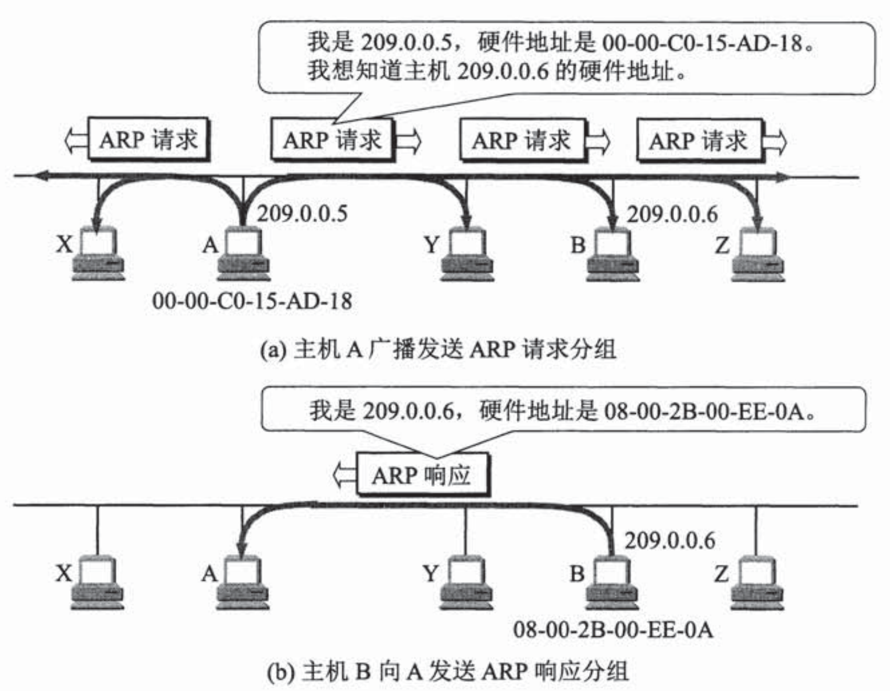

##### 典型情况

1. 发送方和接收方都是同一局域网主机，直接广播ARP分组，找到目标的物理地址
2. 发送方是主机，接收方为不同局域网的主机，广播找到一个路由器R1的硬件地址，交给R1处理
3. 发送方式路由器，接收方为同一局域网主机，在主机所在局域网中广播找到目标主机物理地址
4. 发送方是路由器，接收方为不同局域网主机，在不同局域网上广播找到路由器R2硬件地址，交给R2处理

#### IP数据报格式

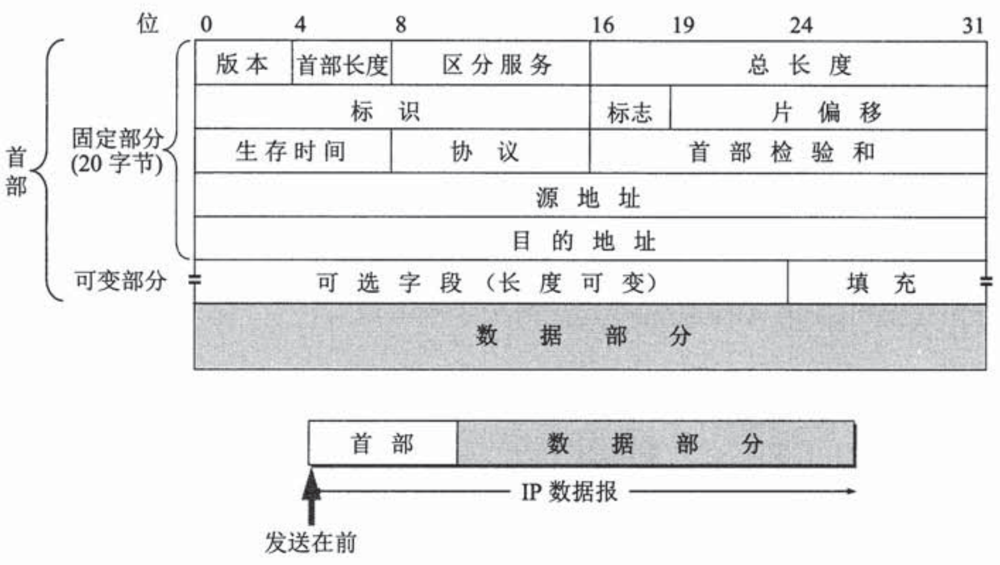

##### 首部固定部分

1. 版本：4位，IP协议的版本，ipv4 or ipv6

2. 首部长度：4位，范围为5~15，单位是32位字长=4字节。当 IP 分组的首部长度不是4字节的整数倍时，必须利用最后的填充字段加以填充

3. 区分服务：8位，用来获得更好的服务，只有使用区分服务时起作用，一般的情况下不使用

4. 总长度：16位，指首部和数据之和的长度，单位为字节。因此数据报最大长度为$2^6-1=65535$字节
   1. 数据链路层规定数据帧的数据字段最大传送单元 MTU，IP数据报封装成链路层帧时，数据报的总长度不能超过MTU 值，若超过必须分片处理。
   2. 每一个IP 数据报越短，路由器转发的速度就越快。IP 协议规定，互联网中所有主机和路由器，必须能够接受长度不超过 $60+512+4$字节的数据报（4为富余量），否则就要进行分片。
   3. 在进行分片时，数据报首部中的"总长度"字段是指分片后的每一个分片的首部长度与该分片的数据长度的总和。
   
5. 标识：16位。IP 软件在存储器中维持一个计数器，每产生一个数据报，计数器就加 1，并将此值赋给标识字段。相同的标识字段的值使分片后的各数据报片最后能正确地重装成为原来的数据报

6. 标志：3位，目前只有两位有意义：

      1. 标志字段中的最低位记为MF(More Fragment)，MF=1表示后面还有分片，MF=0表示若干片中的最后一个
      2. 标志字段中间的一位记为DF(Don't Fragment)，表示不能分片，只有当 DF=0时才允许分片

7. 片偏移：13位，分片后某片在原分组中的相对位置。单位为8个字节长，这意味着每个分片的长度一定是8字节的整数倍
      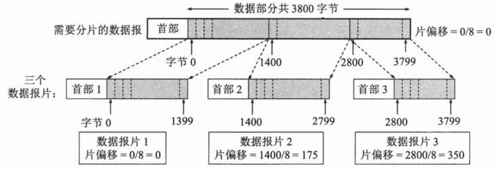
      
8. 生存时间(TTL)：8位，最大数值是255，表明数据报在网络中寿命。由发出数据报的源点设置这个字段，防止无法交付的数据报无限制地在互联网中兜圈子。每经过一个路由器，就把 TTL 减去一定数值，当TTL 值减为零时，就丢弃这个数据报

      1. 最初单位为秒，减去的为在路由消耗时间，小于1秒的记为1秒
      2. 现在 TTL 的单位不再是秒，而是跳数，每次减去的为1，意义是指明数据报在互联网中至多可经过多少个路由器

9. 协议：8位，使目的主机IP层知道应上交给哪个协议

      | 协议名 | ICMP | IGMP |  IP  | TCP  | EGP  | IGP  | UDP  | IPv6 | ESP  | OSPF |
      | :----: | :--: | :--: | :--: | :--: | :--: | :--: | :--: | :--: | :--: | :--: |
      | 字段值 |  1   |  2   |  4   |  6   |  8   |  9   |  17  |  41  |  50  |  89  |
其中IP指IP数据报封装到IP数据报中

10. 首部校验和：16位。这个字段只检验数据报的首部，但不包括数据部分。数据报每经过路由器，路由器都要重新计算一下首部检验和。计算方法∶ 
    
    1. 在发送方，先把 IP 数据报首部划分为许多 16 位字的序列，并把检验和字段置零。用反码算术运算把所有 16 位字相加后，将得到的和的反码**（按位取反）**写入检验和字段
    2. 接收方收到数据报后，将首部的所有 16 位字再使用反码算术运算**（循环进位）**相加一次。将得到的和取反码**（按位取反）**，即得出接收方检验和的计算结果。若首部未发生任何变化，则此结果必为0，于是就保留这个数据报。否则即认为出差错，并将此数据报丢弃。

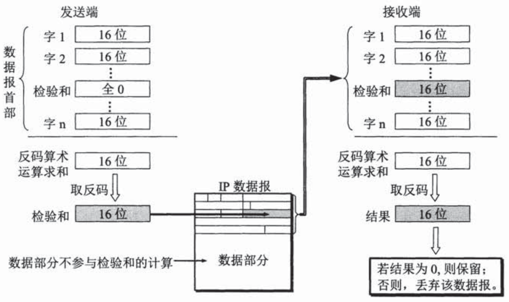

11. 源地址

12. 目的地址

##### 首部可变部分

可选字段用来支持排错、测量以及安全等措施，长度为1到 40 个字节，这些选项很少被使用


#### IP 层转发分组的流程

只研究一个路由器转发到另一个路由器，路由表每一行对应一个网络

对每一条路由最主要的是以下两个信息∶
（目的网络地址，下一跳地址）


##### 特定主机路由

对特定的目的主机而不是所在网络指明一个路由，使管理人员更方便控制、测试，或为了考虑安全问题

##### 默认路由

查找不到目标网络就自动使用默认路由，可以减小路由表所占用的空间和搜索路由表所用的时间，在一个网络只有很少的对外连接时很有用，路由表中默认路由的目标地址常记为0.0.0.0

##### 分组转发算法

1. 从数据报的首部提取目的主机的IP地址D，得出目的网络地址为N。
2. 若N就是与此路由器直接相连的某个网络地址，则直接把目的主机地址D转换为具体的硬件地址，把数据报封装为 MAC 帧，再发送此帧给目的主机；否则就是间接交付执行3
3. 若路由表中有目的地址为D的特定主机路由，则把数据报传送给路由表中所指明的下一跳路由器；否则执行4
4. 若路由表中有到达网络N的路由，则把数据报传送给路由表中所指明的下一跳路由器；否则执行5
5. 若路由表中有一个默认路由，则把数据报传送给路由表中所指明的默认路由器；否则执行6
6. 报告转发分组出错


### 划分子网

#### 三级IP

##### 优点

1. 比两级地址空间利用率高，两级的主机地址用不满，三级可分配
2. 两级地址给每个物理网络分配号码，如果一个路由连接过多网络，路由表开销太大，三级网络数不会太大
3. 两级IP地址不够灵活，三级可随时增加本单位的网络

##### 划分

1. 划分子网属于单位内部事情，本单位以外网络看不到其是由多少个子网组成的，本单位对外仍表现为一个网络
2. 划分子网的方法是从网络的主机号借用若干位作为子网号，$IP地址 ∶∶={ <网络号>，<子网号>， <主机号>}$
3. 其他网络发送给本单位某台主机的IP数据报，仍然根据IP数据报的目的网络号找到连接在本单位网络上的路由器。但此路由器在收到IP数据报后，再按目的网络号和子网号找到目的子网，把IP数据报交付目的主机

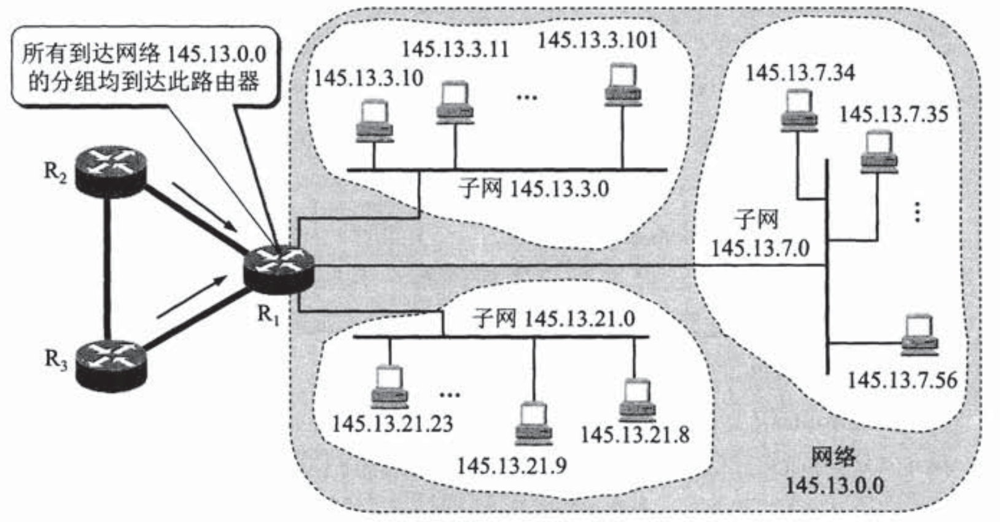

#### 子网掩码

虽然没有特别规定，但是一般都采用一串连续的1，代表取IP地址的前多少位为子网地址。只需要地址与掩码进行与运算，路由器就能知道应该转发到哪个网络

任何路由器都要使用子网掩码，如果不划分子网，采用默认子网掩码（2级IP地址）

路由器在和相邻路由器交换路由信息时，必须把自己所在网络（或子网）的子网掩码告诉相邻路由器。在路由器的路由表中的每一个项目，除了要给出目的网络地址外，还必须同时给出该网络的子网掩码。若一个路由器连接在两个子网上就拥有两个网络地址和两个子网掩码。

互联网标准协议规定子网号不能为全1或全0，但随着CIDR使用，现在也能用了。。。。。

#### 子网分组转发

##### 路由表内容：

1. 目的网络地址
2. 子网掩码
3. 下一跳地址

##### 算法

1. 从收到的数据报的首部提取目的IP地址D。
2. 对路由器直接相连的网络逐个进行检查∶用各网络的子网掩码和 D 逐位相与，看结果是否和相应的网络地址匹配。若匹配，则把分组进行直接交付（当然还需要把D转换成物理地址，把数据报封装成帧发送出去），转发任务结束。否则执行3
3. 若路由表中有目的地址为D的特定主机路由，则把数据报传送给路由表中所指明的下一跳路由器；否则执行4。
4. 对路由表中的每一行，用其中的子网掩码和D逐位相与，其结果为N。若N与该行的目的网络地址匹配，则把数据报传送给该行指明的下一跳路由器；否则执行5。
5. 若路由表中有一个默认路由，则把数据报传送给路由表中所指明的默认路由器；否则，执行6。
6. 报告转发分组出错。


### 构造超网

##### 无分类路由选择CIDR

###### 定义

$IP地址 ∶∶={ <网络前缀>，<主机号>}$

使用斜线计法，网络地址xxx.xxx.xxx.xxx/n，n代表前缀所占位数

###### 划分

网络前缀都相同的连续的IP地址称为CIDR地址块，知道任何一个地址，就能知道其所属块的最小地址和最大地址（主机号全0和全1），实际中一般不使用最大最小地址

CIDR的地址掩码可以看做子网掩码，前缀长度为n，则掩码为n个1后(32-n)个0

###### 优点

分配更灵活，主机个数的种类更多

地址聚合，采用CIDR，原本在路由器中的多个项目变成一个项目就能找到该超网，然后再进行转发，简化了路由表查找


##### 最长前缀匹配

CIDR中每个路由器的项目由网络前缀和下一跳地址组成。匹配符合的时候优先选择具有最长网络前缀路由。


##### 二叉线索查找路由表

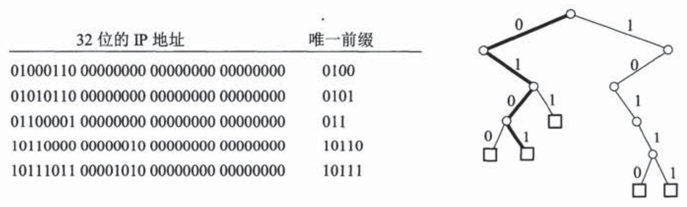

###### 普通的IP搜索 

从根到叶节点的路径代表了路由表中存放的地址

先找出每一个IP对应的唯一前缀，用其构造二叉线索树

查找时按照路径查找，如果没有查找到叶节点则未找到

###### 根据网络前缀匹配

要将二叉线索用于路由表中，必须使二叉线索中的每一个叶节点包含所对应的网络前缀和子网掩码。当搜索到一个叶节点时，就必须将寻找匹配的目的地址和该叶节点的子网掩码进行与运算，看结果是否与对应的网络前缀相匹配。


### 网际控制报文协议ICMP

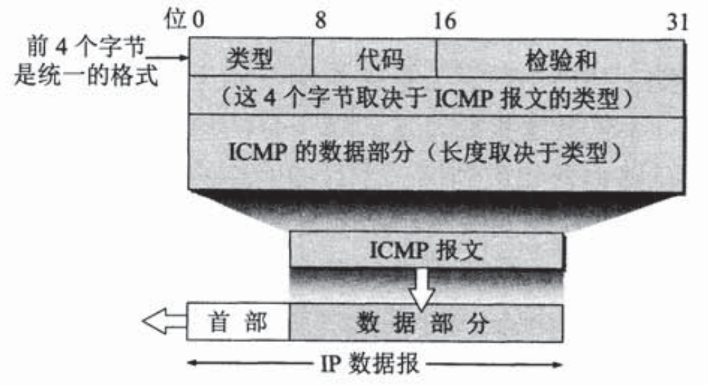

#### 报文种类

1. ICMP差错报告报文
2. ICMP询问报文

| ICMP报文种类 | 类型值 |   ICMP报文类型   |
| :----------: | :----: | :--------------: |
|   差错报告   |   3    |    终点不可达    |
|   差错报告   |   11   |     时间超过     |
|   差错报告   |   12   |     参数问题     |
|   差错报告   |   5    |     改变路由     |
|   差错报告   |   4    |     源点抑制（已不再用）     |
|   询问报文   |  8或0  |  回送请求或回答  |
|   询问报文   | 13或14 | 时间戳请求或回答 |

##### ICMP差错报告

所有ICMP差错报告报文数据字段都有同样的格式：

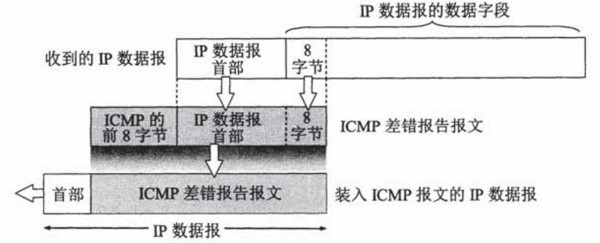

IP数据报数据字段前8字节有运输层端口信息，以及运输层报文发送序号

不应发送差错报告的情况：

1. 对 ICMP 差错报告报文，不再发送 ICMP 差错报告报文
2. 对第一个分片的数据报片的所有后续数据报片，都不发送 ICMP 差错报告报文
3. 对具有多播地址的数据报，都不发送 ICMP 差错报告报文
4. 对具有特殊地址（如127.0.0.0或0.0.0.0）的数据报，不发送ICMP 差错报告报文。


##### ICMP询问报文

1. 回送请求和回答 ICMP 回送请求报文是由主机或路由器向一个特定的目的主机发出的询问。收到此报文的主机必须给源主机或路由器发送 ICMP 回送回答报文。这种询问报文用来测试目的站是否可达以及了解其有关状态。
2. 时间戳请求和回答ICMP 时间戳请求报文是请某台主机或路由器回答当前的日期和时间。在 ICMP 时间戳回答报文中有一个32 位的字段，其中写入的整数代表从 1900 年 1月1 日起到当前时刻一共有多少秒。时间戳请求与回答可用于时钟同步和时间测量。


#### ICMP应用

##### PING

用来测试两主机间的连通性，使用ICMP回送请求与回答报文，从应用层跳过TCP和UDP直接使用IP层

##### Traceroute

用来跟踪包从源点到终点的路径。

从源主机向目的主机发送一连串IP数据报，封装无法交付的UDP用户数据报。

1. 第一个数据报$P_1$的TTL设置为1，当到达路径上的第一个路由器$R_1$时，由于收下后TTL为0，被丢弃并向源主机发送一个 ICMP 时间超过差错报告报文
2. 源主机接着发送第二个数据报$P_2$，并把TTL设置为2，这样一直继续下去
3. 当最后一个数据报刚刚到达目的主机时，因其是无法交付的UDP用户数据报，因此目的主机要向源主机发送 ICMP 终点不可达差错报告报文

所有返回的ICMP报文给出了路由信息——到达目的主机所经过路由器IP地址，以及到达其中每一个路由器往返时间


### 路由选择

#### 基本概念

##### 理想路由算法

1. 算法必须是正确完整：正确是∶ 分组一定能够最终到达目的网络和目的主机
2. 算法在计算上应简单
3. 算法应能适应通信量和网络拓扑的变化
4. 算法应具有稳定性：网络通信量和网络拓扑相对稳定时，应收敛于一个可以接受的解
5. 算法应是公平的
6. 算法应是最佳的：使分组平均时延最小而网络吞吐量最大（没有可靠性重要）


##### 分层次路由选择协议

自治系统AS：单一技术管理下一组路由器，用内部自治的路由选择协议和共同的度量，对其他AS表现出—致的路由选择策略

协议有两类：

1. 内部网关协议(IGP)：AS间叫域间路由选择
2. 外部网关协议(EGP)：AS内叫域内路由选择


#### 内部网关协议RIP

##### 工作原理

一种分布式的基于距离向量的路由选择协议，是互联网的标准协议，最大优点是简单

RIP协议要求网络中的每一个路由器都要维护从它自己到其他每一个目的网络的距离记录，使得从每一个路由器到每一个目的网络的路由都是最短的，所有路由器最终拥有到系统中每个节点的路由信息

距离定义∶

1. 从一路由器到直接连接的网络的距离定义为1
2. 从一路由器到非直接连接的网络的距离定义为所经过的路由器数加1
3. RIP允许一条路径最多只能包含15个路由器，16相当于不可达，可见只适用于小型互联网

特点：

1. 仅和相邻路由器交换信息
2. 路由器交换的信息是当前本路由器所知道的全部信息，即自己现在的路由表
3. 按固定的时间间隔交换路由信息

##### 距离向量算法

###### 核心思想：
设X是结点A到B最短路径上一结点，若拆成两段路径A$\rightarrow$X和X$\rightarrow$B，则每一段路径分别是A到X和X到B的最短路径。

###### 步骤：

1. 对地址为X的相邻路由器发来的RIP报文，先修改此报文中的所有项目：把下一跳字段中地址改为X，把距离加1
2. 对修改后的 RIP 报文中的每一个项目，若原来的路由表中没有目的网络N，则把该项目添加到路由表中；否则执行3
3. 若下一跳路由器地址是X，则把收到的项目替换原路由表中的项目（网络结构更新）；否则执行4
4. 若收到项目中距离d小于路由表中距离则进行更新；否则什么也不做
5. 若3分钟还没有收到相邻路由器的更新路由表，则把此相邻路由器记为不可达的路由器
6. 返回


##### RIP协议报文格式

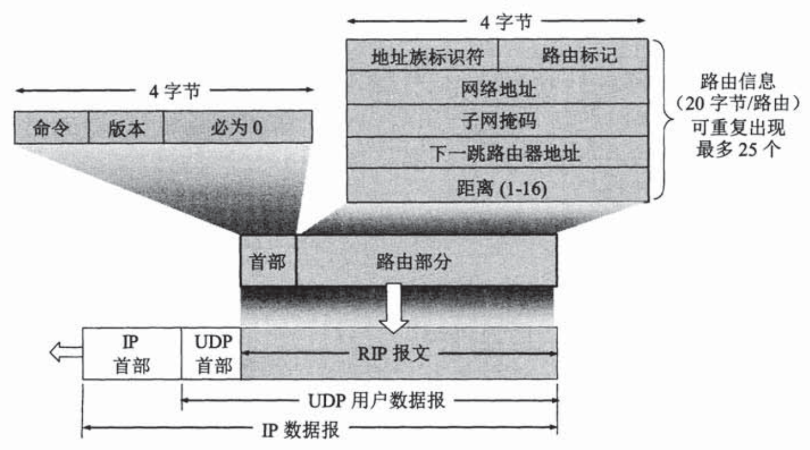

RIP 协议使用运输层的用户数据报 UDP 进行传送，使用 UDP 的端口 520

###### 首部：

命令字段：

1. 为1表示请求路由信息
2. 为2表示对请求路由信息的响应或未被请求而发出的路由更新报文

为4字节字对齐后面补0

###### 路由部分：

每个路由信息20个字节：

1. 地址族标识符用来标志所使用的地址协议，2代表用IP地址

2. 路由标记填入自治系统号ASN（IANA分配）
3. 网络地址
4. 该网络的子网掩码
5. 下一跳路由器地址
6. 网络距离。

###### 鉴别功能：

占用第一个路由信息的地址族标识符置为全1，路由标记写入鉴别类型，剩下的 16 字节为鉴别数据。


##### 存在问题

当网络出现故障时，要经过比较长的时间才能将此信息传送到所有的路由器，收敛速度慢，好消息传播得快，而坏消息传播得慢。


#### 内部网关协议OSPF

##### OSPF基本特点

OSPF：开放最短路径优先

1. 使用分布式链路状态协议，每个路由器用链路状态数据库记录全网拓扑结构
2. OSPF允许管理员给每条路由指派不同的代价
3. 如果到同一个目的网络有多条相同代价的路径，可以将通信量分配给几条路径，达到负载平衡
4. 所有OSPF路由器间交换的分组都具有鉴别的功能，保证仅在可信赖路由器间交换链路状态信息
5. OSPF支持可变长度的子网划分和无分类的编址CIDR
6. OSPF让每一个链路状态都带上一个32位的序号，序号越大状态就越新

###### 与RIP不同点：

1. 使用的方法是洪泛法向本自治系统中所有路由器发送信息
2. 发送的信息：与本路由器相邻的所有路由器的链路状态
   链路状态：本路由器和哪些路由器相邻，以及该链路的度量
3. 只有链路状态变化时，路由器才向所有路由器发送信息

##### 概念

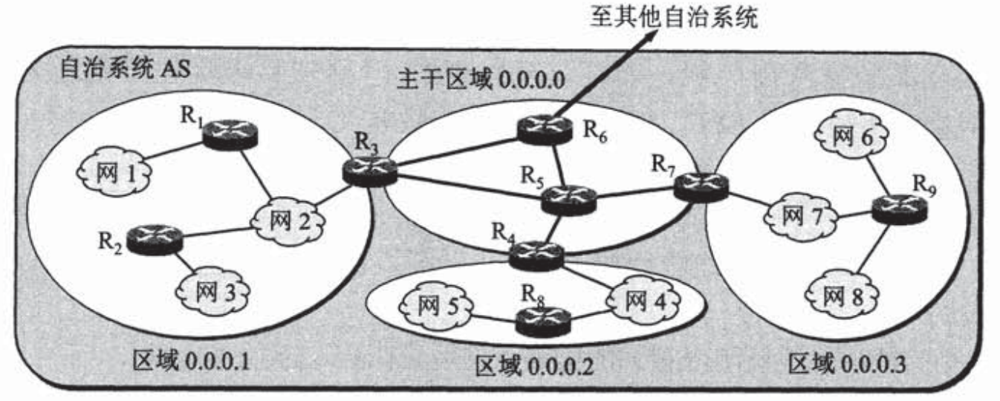

###### 区域：

区域内部路由器只知道本区域网络拓扑，不知道其他区域情况。

1. 主干区域标识符规定为 0.0.0.0，用来连通其他下层区域
   1. 主干区域内路由器叫主干路由器
   2. 和本自治系统外交换路由信息的叫做自治系统边界路由器
2. 其他区域：区域边界路由器对其他区域信息进行概括


##### OSPF数据格式

**OSPF不用UDP，直接用IP数据报**

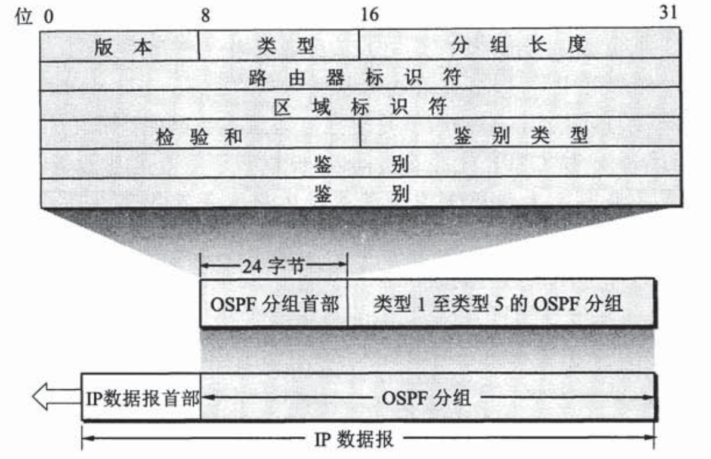


1. 版本：当前的版本号是2
2. 类型：五种类型分组中的一种
3. 分组长度：包括OSPF首部在内的分组长度，以字节为单位
4. 路由器标识符：标志发送该分组的路由器的接口的IP地址
5. 区域标识符：分组属于的区域的标识符
6. 检验和：用来检测分组中的差错
7. 鉴别类型：0代表不用，1代表口令
8. 鉴别：鉴别类型为0时就填入0，鉴别类型为1则填入8个字符的口令

##### 五种分组类型

1. 问候(Hello)：用来发现和维持邻站的可达性
2. 数据库描述(Database Description)：向邻站给出自己的链路状态数据库中的所有链路状态项目的摘要信息
3. 链路状态请求(Link State Request)：向对方请求发送某些链路状态项目的详细信息
4. 链路状态更新(Link State Update)：用洪泛法对全网更新链路状态，路由器将其链路状态通知给邻站
5. 链路状态确认(Link State Acknowledgment)：对链路更新分组的确认

##### 方法

1. 路由器刚开始工作，通过问候分组得知它有哪些相邻路由器，以及向它们发送的代价
2. 和相邻路由器交换本数据库中已有的链路状态摘要信息（有哪些路由器信息及序号写入数据库）
3. 使用链路状态请求，向对方请求发送自己所缺少的某些链路状态项目的详细信息
4. 通过一系列状态更新，建立全网同步的链路数据库
5. 采用可靠洪泛法，需要更新后发送确认（重复更新不需要）

对多点接入的局域网采用指定路由器代表所有链路向各路由器发送状态信息，减少广播信息量


#### 外部网关协议BGP

##### 概念

BGP：边界网关协议

BGP采用路径向量的路由选择协议

##### BGP speaker

1. 一般选定一个路由器为speaker，每一个AS的管理员至少选一个BGP speaker

2. BGP speaker要交换路由信息，需先建立TCP连接(端口号为179)，然后在此连接上交换BGP报文，这两个speaker彼此成为对方的邻站或对等站
3. 除了运行BGP协议还需要运行OSPF和RIP
4. 支持CIDR，路由表中交换的信息应包括目的网络前缀、下一跳路由器、到达该目的网络所要经过的自治系统序列
5. 根据最终的信息，speaker可以自己算出到各自治系统的路由，最终导出为一个连通的树（无环）
6. BGP刚运行时和邻站交换整个路由表，之后有变化才更新

##### 报文类型&格式

1. OPEN报文：用来与相邻的另一个BGP发言人建立关系，使通信初始化
   1. 版本：1 字节，现在的值是4
   2. 本自治系统号：2字节，使用全球唯一的16位自治系统号，由ICANN地区登记机构分配
   3. 保持时间：2字节，以秒计算的保持为邻站关系的时间
   4. BGP标识符：4字节，通常就是该路由器的IP地址
   5. 可选参数长度：1字节
   6. 可选参数
2. UPDATE报文：用来通告某一路由的信息，以及列出要撤销的多条路由
   1. 不可行路由长度：2字节，指明下一个字段的长度
   2. 撤销的路由：列出所有要撤销的路由
   3. 路径属性总长度：2 字节，指明下一个字段的长度
   4. 路径属性：定义在这个报文中增加的路径的属性
   5. 网络层可达性信息NLRI：定义发出此报文的网络，包括网络前缀位数、IP地址前缀
3. KEEPALIVE报文：用来周期性地证实邻站的连通性，只有BGP的通用首部
4. NOTIFICATION报文：用来发送检测到的差错
   1. 差错代码：1字节
   2. 差错子代码：1字节
   3. 差错数据：给出有关差错的诊断信息

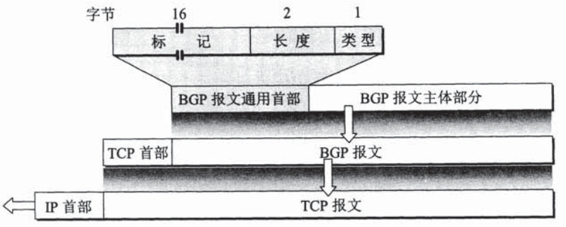

通用首部：

1. 标记字段：16字节长，用来鉴别收到的BGP报文，不使用鉴别时置为全1
2. 长度字段：2字节长，包括通用首部在内的整个BGP报文以字节为单位的长度，范围在19~4096
3. 类型字段：1字节长，值为1到4，分别对应四种BGP报文


##### 交换过程

1. 一开始向邻站进行商谈时就必须发送OPEN报文，如果邻站接受这种邻站关系，就用KEEPALIVE报文响应
2. 为此，这两个BGP speaker彼此要周期性地交换KEEPALIVE报文（一般每隔 30 秒）
3. 可以用UPDATE报文撤销以前通知过的路由，也可以增加新路由，一次可以撤销许多条，但只能增加一条


### 路由器

#### 路由器结构

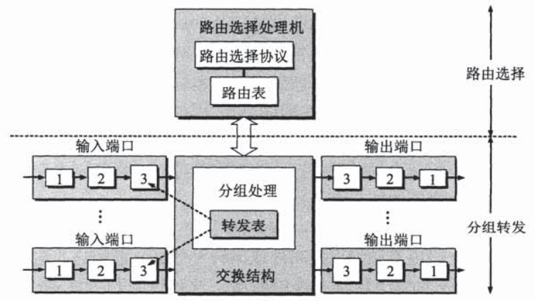

##### 路由选择部分

核心构件是路由选择处理机：根据所选定的路由选择协议构造出路由表，同时经常或定期和相邻路由器交换路由信息，不断地更新和维护路由表

##### 分组转发部分

它由三部分组成∶交换结构、一组输入端口和一组输出端口（硬件接口）

1. 交换结构：根据转发表对分组进行处理，将某个输入端口进入的分组从一个合适的输出端口转发出去
2. 输入端口&输出端口：分为物理、数据链路、网络层三层


##### 需要注意的：

转发：

1. 任务：把收到的IP数据报从路由器合适的端口转发出去，仅仅涉及到一个路由器
2. 转发表：从路由表得出，转发表每一行必须包含从要到达的目的网络到输出端口和某些MAC地址信息（如下一跳的以太网地址）的映射
3. 数据结构：转发表的结构应当使查找过程最优化，转发表则甚至可用特殊的硬件来实现

路由选择：

1. 任务：按照复杂的路由算法，得出整个网络的拓扑变化情况，因而能够动态地改变所选择的路由，并由此构造出整个的路由表，涉及到很多路由器
2. 路由表：路由表一般仅包含从目的网络到下一跳（用 IP 地址表示）的映射
3. 数据结构：路由表则需要对网络拓扑变化的计算最优化，路由表总是用软件实现的




线速：输入端口处理速率等于分组传送到路由器的速率，一个2.5Gbit/s的链路，分组长度256字节，线速大于1Mpps（百万分组/秒）


##### 工作方式

1. 输入端口
   1. 物理层进行比特的接收
   2. 数据链路层则按照链路层协议接收传送分组的帧，对帧首尾进行剥去
   3. 网络层中，当一个分组在查表，紧跟着收到另一个分组，必须在队列中排队等待，产生一定时延
2. 送入交换结构
   1. 若为路由器间交换信息分组（如RIP或OSPF分组等），则把其送交路由器的路由选择部分中的路由选择处理机
   2. 若为数据分组，则按照分组首部中的目的地址查找转发表
      复制的转发表放在每一个输入端口中，路由选择处理机负责对各转发表的副本进行更新，可以避免在路由器中的某一点上出现瓶颈
3. 输出端口
      1. 网络层中设有一个缓冲区，当交换结构传送过来的分组的速率超过输出链路的发送速率时，存入来不及发送的分组
      2. 数据链路层处理模块把分组加上链路层的首部和尾部
      3. 物理层发送到外部线路


##### 交换方法

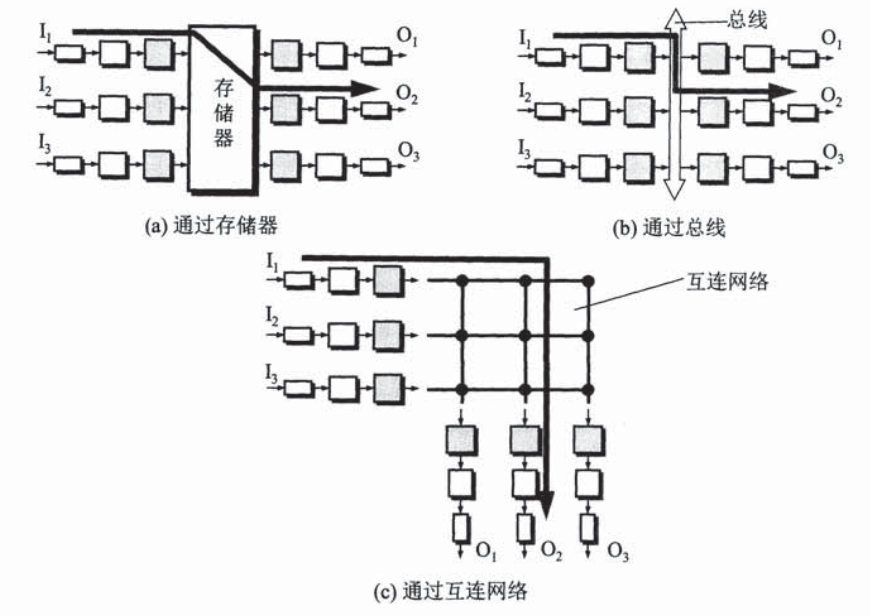

1. 最早路由器利用计算机CPU作为路由选择处理机：
   1. 输入输出端口相当于I/O设备，收到分组时用中断方式通知路由选择处理机
   2. 分组就从输入端口复制到存储器中
   3. 路由器处理机从分组首部提取目的地址，查找路由表，再将分组复制到合适的输出端口缓存中，交换速率不大于读或写速度的一半
2. 通过存储器进行交换：目的地址的查找和分组在存储器中缓存都在输入端口进行
3. 通过总线进行交换：数据报从输入端口通过共享总线直传到输出端口，不需要路由选择处理机干预。但是由于总线共享，因此同一时间只有一个分组在总线上传送，若发现总线忙则在输入端口排队等待，路由器转发速率不高于总线速率
4. 通过纵横交换结构进行交换：有2N条总线，使N个输入端口和N个输出端口相连接，交叉结点使水平或垂直总线接通断开，决定了转发到哪个端口
   1. 当输入端口收到一个分组时，就将它发送到与该输入端口相连的水平总线上
   2. 若转发输出端口垂直总线空闲，则垂直总线与水平总线接通
   3. 若垂直总线被占用，则后到达的分组就被阻塞，必须在输入端口排队


### IPv6

#### IPv6变化

##### 整体变化：

1. 更大的地址空间：从32增大到128
2. 扩展的地址层次结构：IPv6 由于地址空间很大，因此可以划分为更多的层次
3. 灵活的首部格式：定义了许多可选的扩展首部，提供更多功能，提高路由器效率，路由器对扩展首部不进行处理（除逐跳扩展首部外）
4. 改进的选项：允许数据报包含有选项的控制信息，因而可以包含一些新的选项，放在有效载荷中
5. 允许协议继续扩充
6. 支持自动配置：不需要使用DHCP
7. 支持资源的预分配：支持实时视像等要求保证一定的带宽和时延的应用
8. 

##### 字段变化

1. 首部4字节对齐改为8字节对齐
2. 首部长度不定长变为固定40字节
3. 取消了服务类型字段，因为优先级和流标号字段实现了服务类型字段的功能
4. 取消了总长度字段，改用有效载荷长度字段
5. 取消了标识、标志和片偏移字段，因为这些功能已包含在分片扩展首部中
6. TTL字段改称跳数限制字段
7. 取消了协议字段，改用下一个首部字段
8. 取消了检验和字段，这样就加快了路由器处理数据报的速度（运输和数据链路都有检验）
9. 取消了选项字段，而用扩展首部来实现选项功能

#### IPv6组成

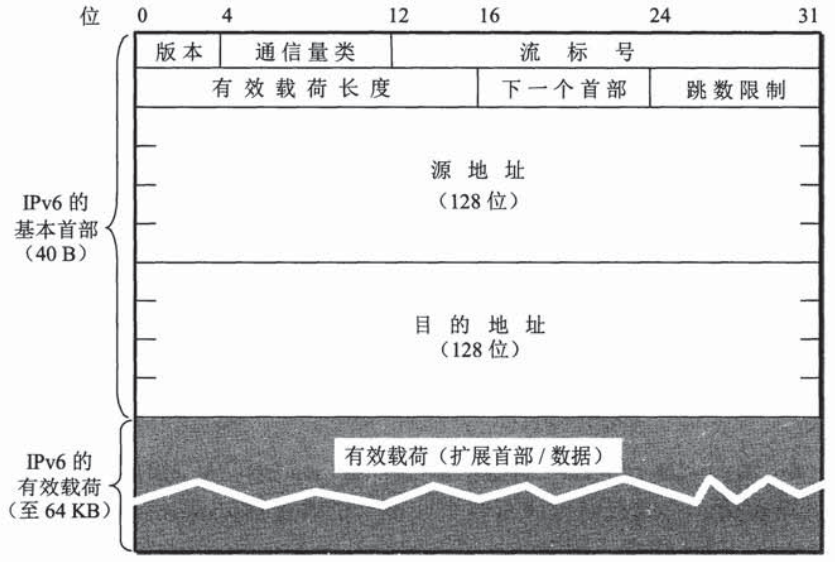

##### 基本首部

1. 版本：4bit，指明协议版本
2. 通信量类：8bit，区分不同的IPv6数据报类别或优先级
3. 流标号：20bit，IPv6允许路由器把每一个数据报与一个给定的资源分配相联系
   1. 流概念：从特定源点到特定终点（单播或多播）的一系列数据报（如实时音频或视频传输），同一个流的数据报都具有同样的流标号，可保持质量
   2. 传统电子邮件或非实时数据，流标号则没有用处，把它置为0
4. 有效载荷长度：16bit，指明除基本首部以外的字节数，最大值是65535
5. 下一个首部：8bit
   1. 没有扩展首部时，指出基本首部后面的数据应交付 IP 层上面的哪一个高层协议（TCP为6，UDP为17）
   2. 有扩展首部时，标识后面第一个扩展首部的类型
6. 跳数限制：8bit，用来防止数据报在网络中无限期地存在，最大值255，过一个路由器减1
7. 源地址：128bit，发送端IP地址
8. 目的地址：128bit，接收端IP地址

##### 有效载荷

###### 拓展首部

允许有零个或多个扩展首部，种类为∶

1. 逐跳选项
2. 路由选择
3. 分片
4. 鉴别
5. 封装安全有效载荷
6. 目的站选项。

扩展首部由若干个字段组成，长度不同，但第一个字段都是8位的下一个首部字段，有多个扩展首部时，应按以上先后顺序出现



###### 数据部分

放在拓展首部之后


#### IPv6地址

##### 基本类型地址

1. 单播（unicast）：点对点通信。
2. 多播（multicast）：一点对多点的通信，发送每一个地址
3. 任播（anycast） ：一点对多点，但数据报只交付其中的一个，通常是距离最近的一个

主机和路由器均称为结点，一个结点可能有多个与链路相连的接口，每一个接口指派一个IP地址，因此一个结点可以有多个单播地址，均可当作目的地址

##### 记法

冒号十六进制： `68E6:8C64:FFFF:FFFF:0:1180:960A:FFFF`

允许使用零压缩：`FF05:0:0:0:0:0:0:B3`$\rightarrow$`FF05::B3`，`0:0:0:0:0:0:0:0`$\rightarrow$`::`，地址中只能使用一次零压缩

与IPv4混合记法：`0:0:0:0:0:0:128.10.2.1`或`::128.12.2.1`

CIDR斜线法：`12AB::CD30:0:0:0:0/60`

##### 地址分类

|     地址类型     |             二进制前缀              | 源地址 | 目的地址 |
| :--------------: | :---------------------------------: | :----: | :------: |
|    未指明地址    |  0000.....0（128位），可记为::/128  |  可以  |   不可   |
|     环回地址     | 0000......1（128位），可记为::1/128 |  可以  |   可以   |
|     多播地址     |   11111111（8位），可记为FF00::/8   |  不可  |   可以   |
| 本地链路单播地址 | 1111111010（10位），可记为FE80::/10 |        |          |
|   全球单播地址   |                其他                 |  可以  |   可以   |

1. 未指明地址：这个地址不能用作目的地址，只能当作某主机源地址使用，条件是这台主机还没有配置到一个标准的 IP 地址
2. 环回地址：IPv4的环回地址一样
3. 多播地址：发送多播信息
4. 本地链路单播地址：使用TCP/IP协议但没连接到互联网上，可以这种本地地址通信，但不能和互联网上的其他主机通信
5. 全球单播地址：这一类单播地址使用得最多，可用多种方法进行划分
   


#### IPv4到IPv6过渡

一部分主机（或路由器）装有双协议栈∶一个IPv4和一个IPv6，记为IPv6/IPv4，具有IPv4和IPv6地址，因此与IPv6和IPv4系统都能通信

##### 双协议栈工作原理：

1. 用域名系统DNS来查询目的主机是IPv4还是IPv6地址
2. 若IPv6转IPv4，把IPv6数据报首部转换为IPv4数据报首部后发送
3. 若IPv4转IPv6，恢复原来的IPv6数据报，首部中的某些字段无法恢复，例如流标号只能变为空缺

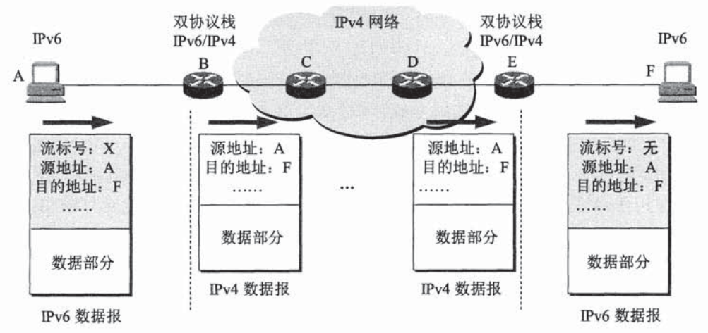

##### 隧道技术工作原理

1. 用域名系统DNS来查询目的主机是IPv4还是IPv6地址
2. 若IPv6转IPv4，把IPv6数据报封装放入IPv4数据报数据部分，把IPv4首部的协议字段的值设置为41，目的地址和源地址设置为隧道出口和入口
3. 当IPv4转IPv6，把IPv4数据报的数据部分（即原来的 IPv6 数据报）交给主机IPv6协议栈

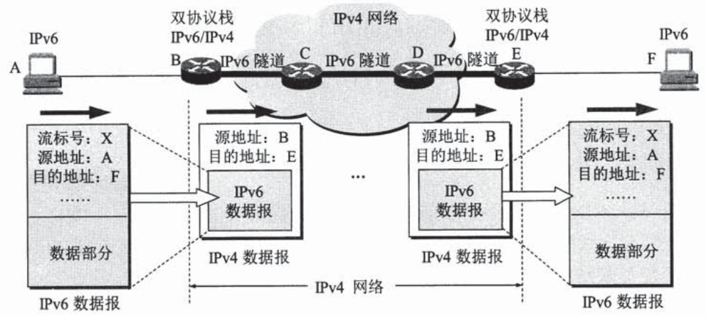

#### ICMPv6

IPv6也不保证数据报的可靠交付，会丢弃数据报，ICMPv6反馈差错信息，合并了地址解析协议ARP和网际组管理协议IGMP功能，ICMPv6面向报文，利用报文来报告差错、获取信息、探测邻站、管理多播通信，增加定义报文功能和含义的其他协议

分类：

1. 差错报文
2. 信息报文
3. 邻站发现报文（ND协议）
4. 组成员关系报文（MLD协议）


### IP多播

#### 基本概念

##### 优点

多播可大大节约网络资源，不需要重复发送副本

##### 地址

多播数据报用D类IP地址（多播组标识符）作为目的地址，并且首部中协议字段值为2，表明使用IGMP

##### 注意点&特性

多播数据报也是尽最大努力交付

多播地址只能用于目的地址，而不能用于源地址

对多播数据报不产生ICMP差错报文。

#### 局域网上硬件多播

IANA拥有的以太网地址块高24位为`00-00-5E`，因此 TCP/TP协议使用的以太网多播地址块的范围是`00-00-5E-00-00-00`到`00-00-5E-FF-FF-FF`

MAC地址的第1字节的最低位为1时即为多播地址，且占IANA分配的地址数一半，范围是`01-00-5E-00-00-00`到`01-00-5E-7F-FF-FF`，只有23位可用作多播

由于多播IP地址与以太网硬件地址的映射关系不是唯一的，因此收到多播数据报的主机，还要在IP层利用软件进行过滤，把不是本主机要接收的数据报丢弃

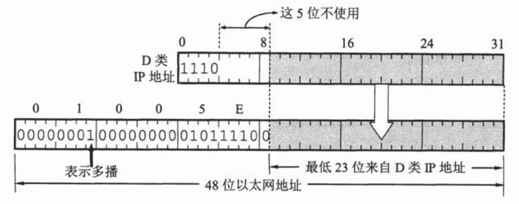

#### 网际组管理IGMP

IGMP协议是让连接在**本地局域网上**的多播路由器知道**本局域网上**是否有主机（进程）参加或退出了某个多播组

目前版本IGMPv3，IGMP 使用 IP 数据报传递其报文，但它也向 IP 提供服务。

##### 工作流程

1. 主机加入时，向多播地址发送IGMP报文，声明自己，本地的多播路由器收到报文后，利用多播路由选择协议把当前组成员关系转发给互联网上的其他多播路由器
2. 本地多播路由器周期性（默认125秒）对所有组发送探寻报文（也允许单发），几次探寻中有一台主机对某个组响应就认为其活跃，否则认为全部离开，不再转发此组成员关系

##### 具体措施

1. 主机和多播路由器间都用IP多播，在支持硬件多播网络上，IGMP报文尽可能用硬件多播，因此未参加多播主机不会收到报文

3. 一个网络上有多个多播路由器时，能够迅速有效选择其中一个来探询主机的成员关系，不会引起IGMP通信量增大

4. IGMP询问报文中有一个数值N为最长响应时间（默认为10秒），收到询问时，主机在0到N之间随机选择发送响应所需时延。一台主机同时参加几个多播组，则主机对每一个多播组选择不同的随机数，最小时延响应最先发送

5. 同一个组内的每一台主机都要监听响应，只要有本组的其他主机先发送了响应，自己就可以不再发送响应了

6. 一台主机多个进程都加入某多播组，主机对发给多播组的每个数据报接收一个副本，然后复制给每个进程

   

#### 多播路由选择协议

多播路由选择实际上就是要找出以源主机为根节点的多播转发树，每一个多播路由器向树的叶节点方向转发收到的多播数据报，但在多播转发树上的路由器不会收到重复的多播数据报（即多播数据报不应在互联网中兜圈子）。不同的多播组、不同的源点都会有不同多播转发树。

##### 协议中主要方法

###### 洪泛与剪除——RPB

这种方法适合于较小的多播组，而所有的组成员接入的局域网也是相邻接的。
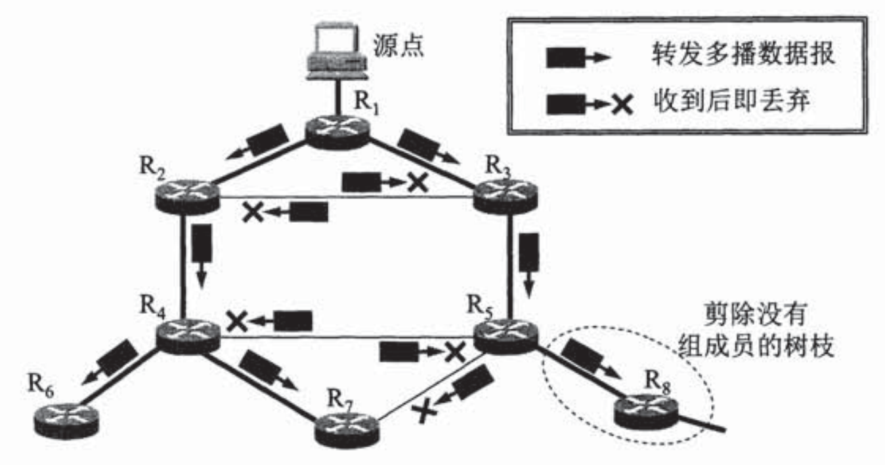

1. 一开始，路由器转发多播数据报使用洪泛的方法广播
2. 路由器收到多播数据报时，从本路由器寻找到源点最短路径的第一个路由器$R_1$是否为多播数据报送来的路由器，如果有多个$R_1$，选IP地址最小的
3. 若是，就向除进入方向的所有其他方向转发收到的多播数据报；否则丢弃

如果多播转发树上某路由器发现它的树枝已没有该多播组的成员，就应把它和下游的树枝一起剪除；又有成员的时候重新接入

###### 隧道技术IP-in-IP

隧道技术适用于多播组的位置在地理上很分散的情况，两个支持多播的网络中间需要经过不支持多播的网络。

路由器$R_1$对多播数据报加上普通数据报首部，封装为单播数据报。然后通过其他网络（隧道）发送到$R_2$，$R_2$剥去首部，恢复为原来多播数据报，继续向多个目的站转发
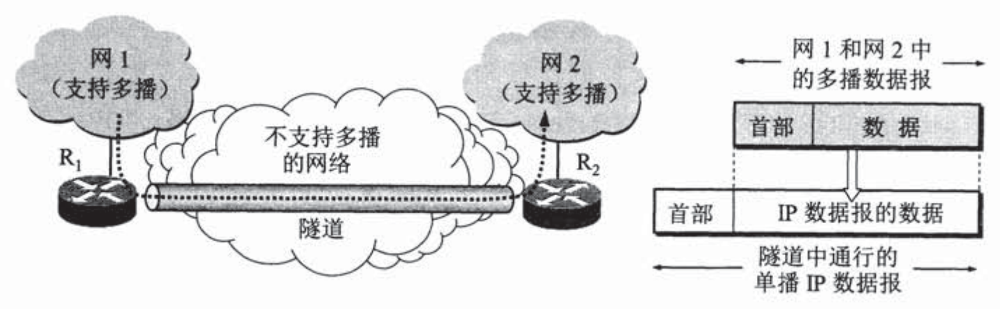

###### 基于核心的发现技术

这种方法对于多播组的大小在较大范围内变化时都适合。

1. 每一个多播组$G$指定一个核心路由器，给出它的IP单播地址
2. 核心路由器创建出多播组$G$的转发树
3. 路由器$R_1$向这个核心路由器发送数据报，那么途中经过的每一个路由器都要检查其内容，若这个路由器$R_2$参加了多播组$G$，就处理这个数据报
   1. 如果$R_1$发出的是一个多播数据报，其目的地址是$G$的组地址，$R_2$就向多播组$G$的成员转发这个多播数据报
   2. 如果$R_1$发出的数据报是一个请求加入多播组$G$的数据报，$R_2$就把这个信息加到它的路由中，并用隧道技术向$R_1$转发每一个多播数据报的一个副本

##### 真实协议

1. 距离向量多播路由选择协议`DVMRP`(Distance Vector Multicast Routing Protocol)：是在互联网上使用的第一个多播路由选择协议，UNIX系统中实现RIP的程序叫routed，mrouted使用DVMRP在路由器之间传播路由信息
2. 基于核心的转发树`CBT`(Core Based Tree)：使用核心路由器作为转发树的根节点，一个大自治系统可划分为几个区域，每一个区域选择一个核心路由器
3. 开放最短通路优先的多播扩展`MOSPF`(Multicast extensions to OSPF)：是单播路由选择协议OSPF的扩充，使用多播链路状态路由选择创建出基于源点的多播转发树
4. 协议无关多播-稀疏方式`PIM-SM`(Protocol Independent Multicast-Sparse Mode)：使用核心路由器作转发树根，虽然在建立多播转发树时是使用单播数据报来和远程路由器联系的，但不要求使用特定单播路由选择协议，适用于组成员的分布非常分散的情况
5. 协议无关多播-密集方式`PIM-DM`(Protocol Independent Multicast-Dense Mode)：使用洪泛方式转发数据报，适用于组成员的分布非常集中的情况


### VPN

#### 专用IP地址（可重用地址）

这些地址只能用于一个机构的内部通信，而不能用于和互联网上的主机通信：

1. 10.0.0.0到10.255.255.255（或记为 10.0.0.0/8，它又称为24位块）
2. 172.16.0.0到172.31.255.255（或记为172.16.0.0/12，它又称为20位块）
3. 192.168.0.0到192.168.255.255（或记为192.168.0.0/16，它又称为16位块）

#### VPN定义

利用公用的互联网作为本机构各专用网之间的通信载体的专用网，用于机构内部主机通信，VPN的每一个场所系统都需要知道其他场所地址

#### 工作流程

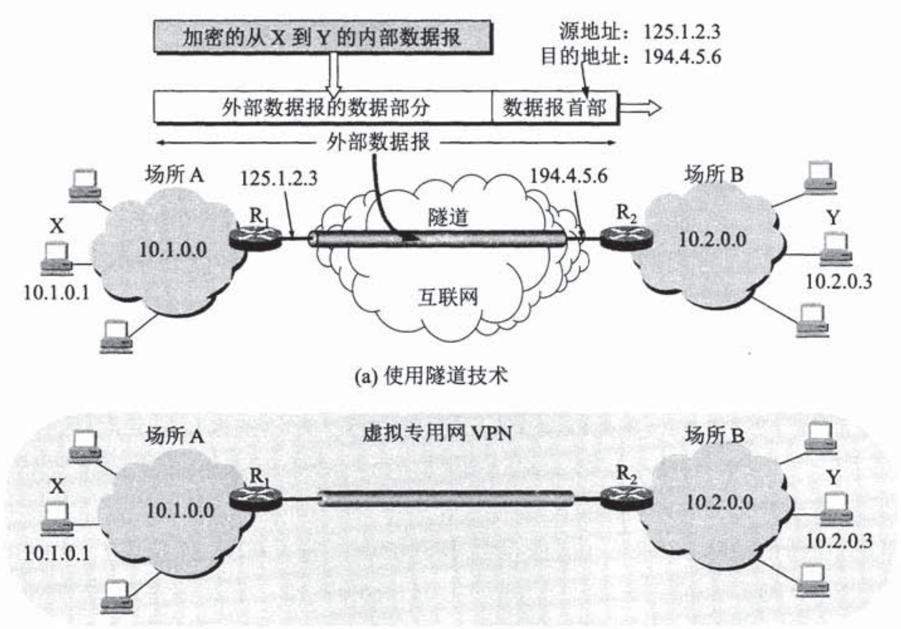

1. $X$想联系$Y$，先在本机构内部发送数据报到与互联网连接的路由器$R_1$，源地址$X$，目的地址$Y$
2. 路由器$R_1$收到内部数据报发现目的网络必须通过互联网才能到达，创建新数据报，首部中源地址是$R1$的全球地址、目的地址是$R_2$的全球地址，内部数据报加密放入数据部分，封装为互联网外部数据报
3. 路由器$R_2$收到数据报将数据部分取出解密，恢复原来内部数据报（源地址$X$，目的地址$Y$），在内部网络交付主机$Y$


### NAT&NAPT

下面讨论另一种情况，就是在专用网内部的一些主机本来已经分配到了本地 IP 地址（即仅在本专用网内使用的专用地址），但现在又想和互联网上的主机通信（并不需要加密），那么应当采取什么措施呢?

#### NAT路由器

1. 有NAT软件
2. 至少有一个有效外部全球IP地址

这样，所有使用本地地址的主机在和外界通信时，都要在 NAT 路由器上将其本地地址转换成全球 IP 地址，才能和互联网连接。

#### 工作流程

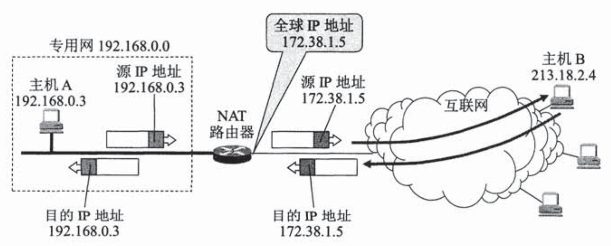

1. $A$想发报文给$B$， 源IP地址为$A$，目的IP地址为$B$
2. NAT路由器$R$在专用网内部收到$A$发给$B$数据报，把源IP地址$A$转换为$R$的全球地址转发
3. $B$收到这个数据报，发送应答的数据报目的IP地址是$R$的全球IP地址，源地址$B$
4. $R$收到$B$的数据报，通过NAT地址转换表，把应答数据报目的IP地址转换为$A$

#### NAT地址转换表

| 方向 |    字段    |  旧IP地址   |  新IP地址   |
| :--: | :--------: | :---------: | :---------: |
|  出  |  源IP地址  | 192.168.0.3 | 172.38.1.5  |
|  入  | 目的IP地址 | 172.38.1.5  | 192.168.0.3 |
|  出  |  源IP地址  | 192.168.0.7 | 172.38.1.6  |
|  入  | 目的IP地址 | 172.38.1.6  | 192.168.0.7 |

NAT路由器有$n$个全球IP地址，则专用网内最多同时有$n$台主机接入到互联网，主机较多需轮流使用地址，因此外部发起请求则不知道如何转化为内部地址，内部主机不能充当服务器用


#### NAPT地址转换表

| 方向 |        字段        | 旧IP地址与端口号  | 新IP地址与端口号  |
| :--: | :----------------: | :---------------: | :---------------: |
|  出  |   源IP:TCP源端口   | 192.168.0.3:30000 | 172.38.1.5:40001  |
|  出  |   源IP:TCP源端口   | 192.168.0.4:30000 | 172.38.1.5:40002  |
|  入  | 目的IP:TCP目的端口 | 172.38.1.5:40001  | 192.168.0.3:30000 |
|  入  | 目的IP:TCP目的端口 | 172.38.1.5:40002  | 192.168.0.4:30000 |

加上运输层端口号可使多个本地主机共用一个NAT路由器上的全球IP地址，同时和互联网上不同主机通信


#### 特殊点

1. 普通路由器转发IP数据报时，不改变源IP地址、目的IP地址；NAT路由器更换地址
2. 普通路由器转发分组工作在网络层；NAPT路由器查看转换运输层端口号，属于运输层


### MPLS

#### 基本概念

MPLS：多协议标记交换

LSR：同时具有标记交换和路由选择这两种功能，标记交换可快速转发，需要先使用路由选择功能构造转发表

MPLS域：该域中有许多彼此相邻的标记交换路由器LSR

显式路由选择：由入口LSR确定MPLS域内转发路径，像虚连接

#### MPLS特点

1. MPLS上层可以采用多种协议；下层可用多种链路层协议（如PPP、以太网、ATM、帧中继）
2. 支持面向连接的服务质量
3. 支持流量工程，平衡网络负载
4. 有效地支持VPN
5. 每个分组携带标记

#### 基本工作原理

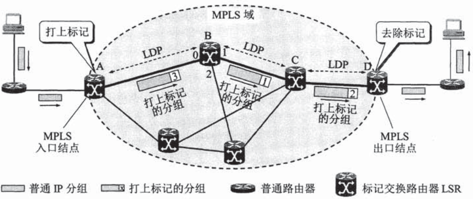

1. MPLS域的入口处给每个IP数据报加标记，然后

2. MPLS域中各LSR使用标记分配协议LDP交换报文，找出标记对应交换路径LSP，根据路径构造转发表

3. MPLS域入口给不同类IP数据报加标记，严格按照网络层分类只使用IP首部字段，但运营商用了运输层TCP或UDP首部端口号，甚至有应用层分类
   
4. 入口按照转发表把它转发给下一个LSR，以后所有LSR不再上升到第三层查找转发表，而是查找标记对换表把入标记更换成为出标记，在链路层用硬件进行转发，标记不全局通用，相邻LSR间沟通使用

   | 入接口 | 入标记 | 出接口 | 出标记 |
   | :----: | :----: | :----: | :----: |
   |   0    |   3    |   1    |   1    |

5. MPLS出口结点把MLPS标记去除，把IP数据报交付非MPLS的主机或路由器，按照普通的转发方法转发


#### 转发等价类FEC

##### 定义

路由器按照同样方式对待的IP数据报集合，从同样接口转发到同样下一跳地址，并且具有同样服务类别和同样丢弃优先级等。

##### 可能种类

1. 目的IP地址与某一个特定IP地址的前缀匹配的IP数据报的集合（普通路由器方式）
2. 所有源地址与目的地址都相同的IP数据报的集合
3. 具有某种服务质量需求IP数据报集合

##### 用途

1. MPLS入口结点对同样FEC的IP数据报指派同样标记。
2. FEC用于负载平衡的例子，这就可能导致这段最短路径过载。


#### 首部位置与格式

IP数据报先要插入MPLS首部再封装成以太网帧，以太网类型字段单播下为8847，多播下为8848，区分这个帧是否携带MPLS标记

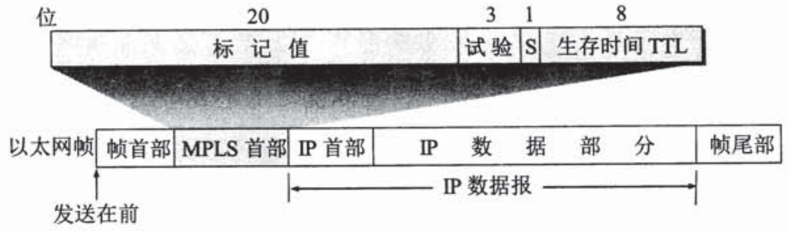

1. 标记值：20bit，理论可容纳$2^{20}$个流，但实际上不会这么多，通常管理员人工设置交换路径
2. 试验：3bit，目前保留用于试验
3. 栈S：1bit，在有标记栈时使用
4. 生存时间TTL：8bit，防止MPLS分组无限循环转发


## 第五章 运输层

### 概述

#### 与网络层区别

1. 网络层为主机之间提供逻辑通信；运输层为应用进程之间提供端到端的逻辑通信
2. 网络层只检查数据报首部，不检查数据部分；运输层对收到的报文进行差错检测
3. 网络层对上层表现一致，屏蔽核心细节；运输层对上层表现（主要是可靠性）因不同协议有很大差别

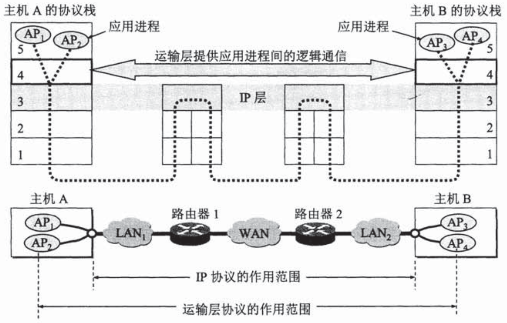

#### UDP与TCP应用

|       应用       |        应用层协议        | 运输层协议 |
| :--------------: | :----------------------: | :--------: |
| 名字（域名）转换 |     DNS（域名系统）      |    UDP     |
|     文件传送     | TFTP（简单文件传送协议） |    UDP     |
|     路由选择     |   RIP（路由信息协议）    |    UDP     |
|    IP地址配置    | DHCP（动态主机配置协议） |    UDP     |
|     网络管理     | SNMP（简单网络管理协议） |    UDP     |
|  远程文件服务器  |   NFS（网络文件系统）    |    UDP     |
|      IP电话      |         专用协议         |    UDP     |
|  流式多媒体通信  |         专用协议         |    UDP     |
|       多播       |  IGMP（网际组管理协议）  |    UDP     |
|     电子邮件     | SMTP（简单邮件传送协议） |    TCP     |
|   远程终端接入   |  TELNET（远程终端协议）  |    TCP     |
|      万维网      |  HTTP（超文本传输协议）  |    TCP     |
|     文件传送     |   FTP（文件传送协议）    |    TCP     |

#### 运输层端口

##### 特性

1. 由软件实现
2. 屏蔽了不同操作系统种类异构性
3. 屏蔽了目的主机进程管理异构性，报文只需要交付到目的主机端口，剩下的由TCP或UDP完成
4. 只在本地有意义，有端口到进程的映射关系

##### 种类

1. 服务器端使用端口号：0~49151
   1. 熟知端口号：0~1023，分配给TCP/IP最重要的一些应用程序，让所有的用户都知道
   
      | 应用程序 | FTP  | TELNET | SMTP | DNS  | TFTP | HTTP | SNMP | SNMP(trap) | HTTPS |
      | :------: | :--: | :----: | :--: | :--: | :--: | :--: | :--: | :--------: | :---: |
      |  端口号  |  21  |   23   |  25  |  53  |  69  |  80  | 161  |    162     |  443  |
   
   2. 登记端口号：1024~49151，分配给没有熟知端口号的应用程序
2. 客户端使用的端口号：49152~65535，分配给客户进程暂时使用，通信结束就不再存在，可供其他进程继续选择


### 用户数据报UDP

#### 特点

1. UDP无连接，减少了开销和发送数据之前的时延。
2. UDP尽最大努力交付，不保证可靠，主机不需维持连接状态表
3. UDP面向报文，应用层报文添加首部后就交付IP层，一次交付一个完整报文
4. UDP没有拥塞控制，网络出现拥塞不会使源主机发送速率降低，可能会导致网络严重拥塞
5. UDP支持一对一、一对多、多对一和多对多的交互通信
6. UDP首部开销小，只有8字节

#### 格式

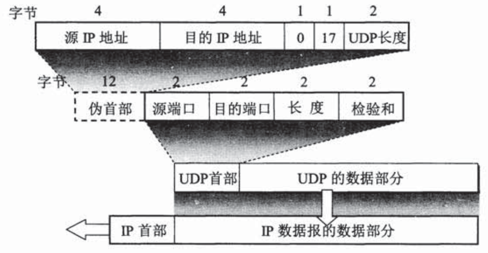

1. 源端口，2字节，不需要时可用全0
2. 目的端口，2字节，必须使用。
3. 长度，2字节，加上首部的整体UDP数据报的长度，最小值是8
4. 检验和，2字节，检测UDP用户数据报是否有错，有错就丢弃。

 #### 工作过程

##### 分用

1. 当运输层从IP层收到UDP数据报，根据首部中目的端口，上交给特定进程
2. 如果接收方UDP收到的报文中目的端口号不正确，丢弃该报文，并由ICMP发送"端口不可达"差错报文给发送方

##### 检验

计算检验和时，在UDP用户数据报之前增加12个字节的伪首部，得到一个临时的UDP用户数据报，仅为计算检验和使用
UDP 计算检验和的方法和计算 IP 数据报首部检验和的方法相似。但UDP的检验把首部和数据部分一起检验。

###### 发送方

1. 把全零放入检验和字段
2. 添加伪首部
3. 将数据部分按偶数字节(16位)对齐，不足的填入全零
4. 按二进制反码计算出这些16位字的和
5. 将此和的二进制反码写入检验和字段
6. 发送数据报

###### 接收方

1. 收到的UDP用户数据报加入伪首部
2. 按偶数字节对齐补0
3. 按二进制反码求每16位的和，无差错时其结果应为全1，否则丢弃

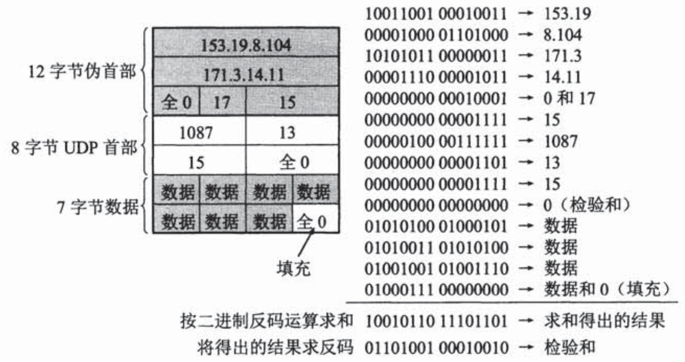


### 传输控制协议TCP基础

#### 特点

1. TCP面向连接，需要传输前建立，传送完释放
2. 每一条TCP连接只能是一对一的
3. TCP提供可靠服务，传送数据无差错、不丢失、不重复，按序到达
4. TCP提供全双工通信，允许通信双方任何时候发送数据，连接的两端都有发送缓存和接收缓存，临时存放双向通信数据
5. 面向字节流，不区分应用层数据边界，仅看成一连串无结构字节流，接收方须有能力识别字节流还原成应用层数据

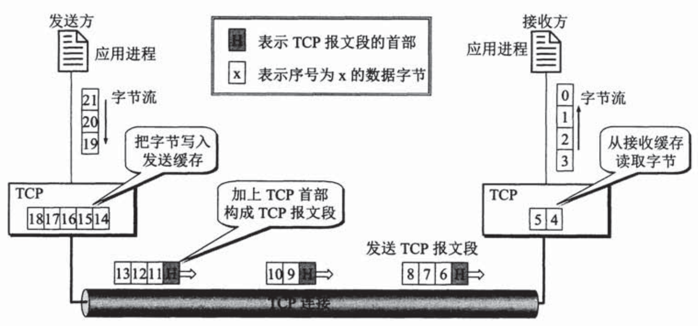

TCP 并不关心应用进程一次把多长的报文发送到TCP 的缓存中，而是根据对方给出的窗口值和当前网络拥塞的程度来决定一个报文段应包含多少个字节。如果应用进程传送到 TCP 缓存的数据块太长，TCP 就可以把它划分短一些再传送。如果应用进程一次只发来一个字节，TCP 也可以等待积累有足够多的字节后再构成报文段发送出去


#### TCP连接

1. TCP连接的端点叫做套接字
2. 端口号拼接到IP地址即构成了套接字$socket=(IP地址:端口号)$
3. 每一条TCP连接唯一地被两个端点所确定$TCP连接∶∶=\{socket_i,socket_a\}=\{(IP_1∶port_1),(IP_2∶port_2)\}$


#### 工作原理

##### 停止等待协议ARQ

每发送完分组等待确认，收到确认后发送下一个分组

###### 出现差错

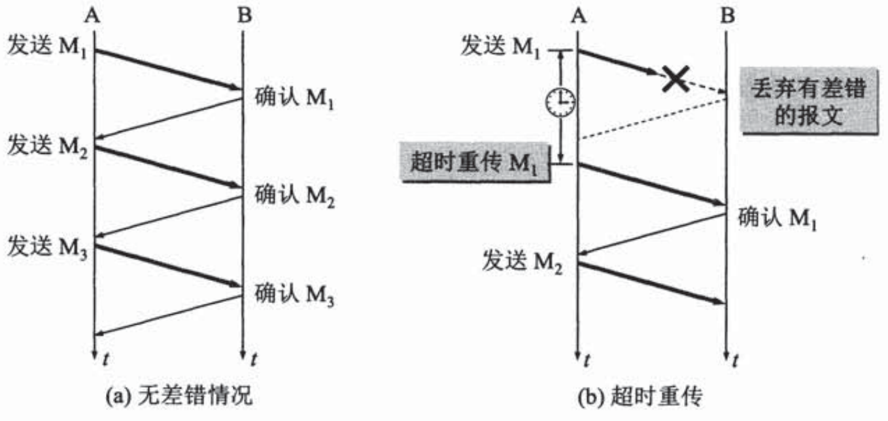

1. A在发送完一个分组后，必须暂时保留已发送分组副本，分组必须进行编号
2. 设置超时计时器，时间应当比数据在分组传输的平均往返时间更长一些
3. 分组在传输过程中或检测时出现差错的情况，B就丢弃，不通知A收到有差错的分组；成功则发送同样编号确认分组
4. A在计时器到期前收到确认，就撤销已设置的超时计时器，否则5
5. 没有收到确认，重传前面发送过的分组


###### 确认信息丢失或超时

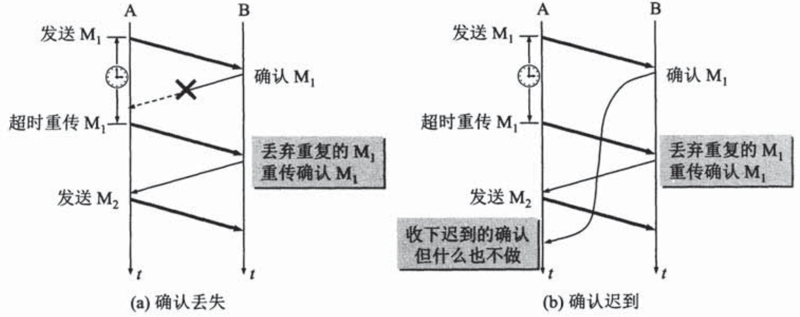

1. B发送的确认信息丢失，B需要丢弃A的重复传输分组，并相A发送确认
2. A收到重复的确认，收下后就丢弃


###### 信道利用率


$T_D$：A发送分组需要时间，$T_D=\frac{分组长度}{数据率}$

$T_A$：B发送确认分组需要时间

$RTT$：往返时间

$U$：信道利用率，$ U=\frac{T_D}{T_D+RTT+T_A}$

ARQ信道利用率很低


##### 连续ARQ


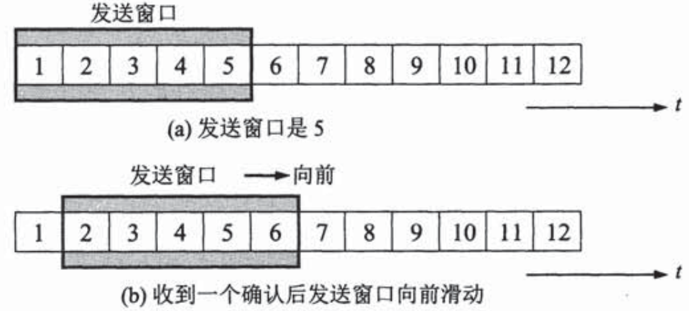

发送方维持发送窗口，分组可连续发送，不需要等待确认；每收到一个确认，就把发送窗口向前滑动一个分组的位置

接收方一般在收到几个分组后，对连续的最后一个分组确认，表示到这个分组之前所有分组都已正确收到


#### TCP格式

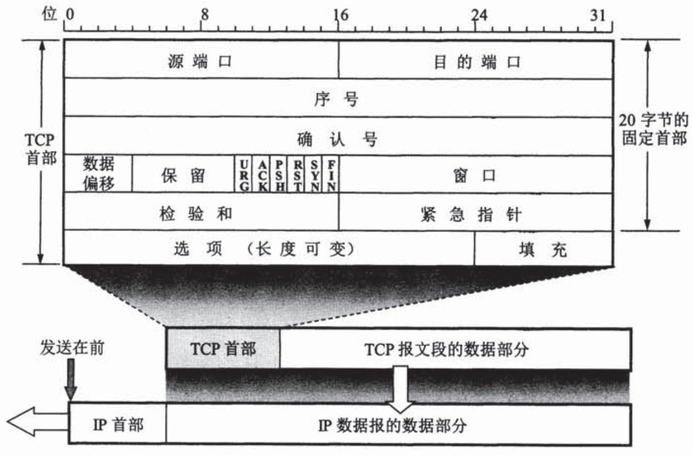


TCP 报文段首部的前20字节固定，后面4n字节为可选项，各字段意义∶

1. 源端口和目的端口：各2字节
2. 序号：4字节，按字节为单位顺序编号，这里是第一字节数据的序号，最大为$2^{32}$，溢出则下一个序号又回到0
3. 确认号：4字节，表明期望收到对方下个报文的开始序号，为$N$表明到序号$N-1$为止的所有数据都已正确收到
4. 数据偏移：4bit，指出TCP报文段首部长度，单位是4字节，最大代表60字节
5. 保留：6bit，保留为今后使用，但目前应置为0
6. 6个控制位，用来说明本报文段的性质：
   1. 紧急(URG)：为1时表明紧急指针字段有效，其为高优先级应尽快传送
   2. 确认(ACK)：为1时确认号字段才有效
   3. 推送(PSH)：为1时，尽快地将前面字节交付接收应用进程，不等缓存填满
   4. 复位(RST)：为1时，表明 TCP连接中出现严重差错必须释放连接，然后再重新建立运输连接(可用来拒绝非法连接)
   5. 同步(SYN)：连接建立时用来同步序号，SYN为1且ACK为0时，表明这是一个连接请求报文段
   6. 终止(FIN)：为1时，表明发送方数据发送完毕，并要求释放连接
7. 窗口：2字节，指当前时刻发送方接收窗口，确认号与窗口决定返回报文字节序号的上下限
8. 检验和：2字节，检验和字段检验的范围包括首部和数据，计算和检验时加上12字节伪首部，与UDP数据报—样，用IPv6则伪首部也要改变
9. 紧急指针：占2字节， $URG=1$时才有意义，紧急数据总字节数，即使窗口为0也可以发送紧急数据
10. 选项：长度可变，最长40字节：
    1. 最大报文段长度MSS：数据字段的最大长度，默认值536。MSS应尽可能大，但最好在IP层不分片，两方向可有不同值
    2. 窗口扩大选项：占3字节，有一字节表示移位值$S$最大值14，与窗口字段16位一起可表示$2^{30}$字节大小窗口
    4. 时间戳选项：占10字节，主要字段为4字节时间戳值、4字节时间戳回送回答，功能为：
       1. 用来计算往返时间。发送时当前时间值放入时间戳，接收方确认时复制到时间戳回送回答字段
       2. 用于处理TCP序号超过$2^{31}$的情况，防止序号绕回
    4. 确认选项


### TCP实现

#### 字节为单位滑动窗口

##### 发送窗口

根据TCP报中的窗口和确认号可以构造自己的发送窗口

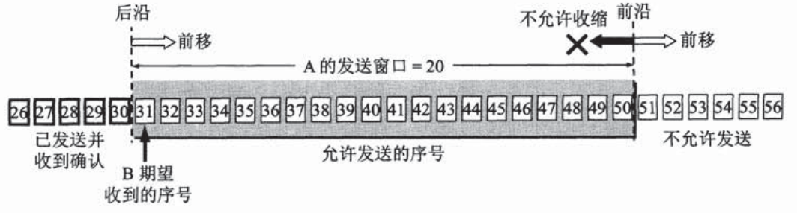

1. 发送窗口后沿后面部分：表示已发送且已确认，不需保留
2. 发送窗口后延：没有收到新的确认则不动、收到了新的确认则前移；不能向后移动，因为不能撤销确认
3. 发送窗口内：没收到对方确认下，允许连续发送的序号，越多效率越高，已发送数据未确认之前暂时保留，以便超时重传
4. 发送窗口前沿：根据是否收到新的确认、对方通知的窗口大小可能前移、不动、收缩(不推荐)
5. 发送窗口前沿前面部分：表示不允许发送的，接收方都没有为这部分数据保留临时存放的缓存空间。

描述发送窗口状态需要三个指针：

1. $P1$：小于$P_1$的是已发送并已收到确认的部分
2. $P2$：$P2-P1=$已发送但尚未收到确认的字节数
3. $P3$：大于$P_3$的是不允许发送的部分，$P_3-P_1=$发送窗口，$P_3-P_2=$​可用窗口


##### 接收窗口

1. 接收窗口后面：已经发送确认且已经交付，可以不再保留
2. 接收窗口内：只能对按序收到的数据中的最高序号给出确认，**有累积确认功能**，没有按序到达只能暂存，出现差错直接丢弃


##### 过程

A发送部分数据，B未按序接收：

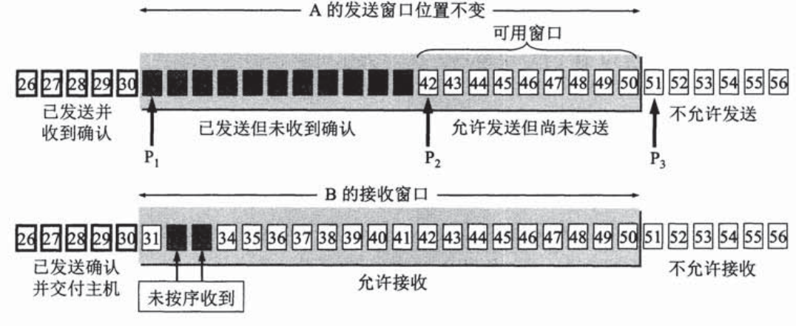

B接收成功，向前滑动，并向A发送确认，A收到确认向前滑动，B继续接收并确认：

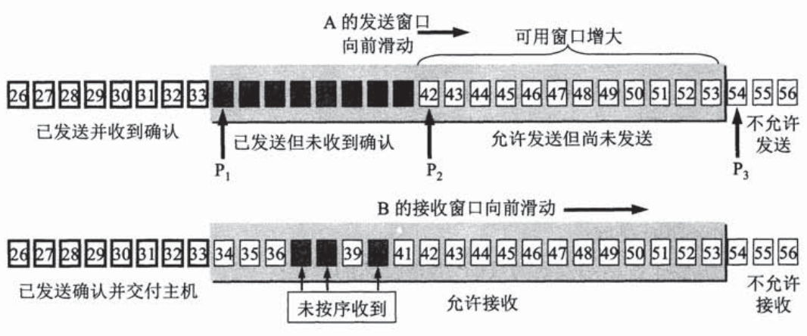

A继续发送直到窗口满，但未收到B的确认：


##### 缓存

发送方的应用进程把字节流写入发送缓存，接收方的应用进程从 TCP 的接收缓存中读取字节流：

1. 缓存空间和序号空间有限且循环使用
2. 实际上缓存或窗口中的字节数非常多

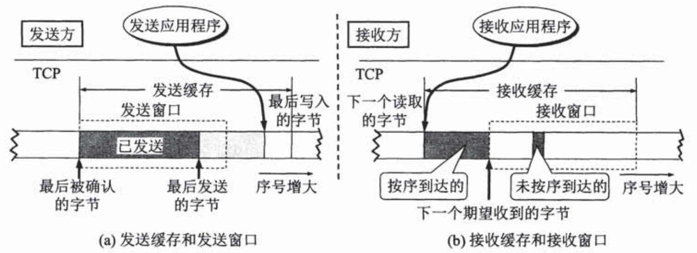

发送缓存用来暂时存放

1. 发送应用程序传送给发送方TCP准备发送的数据
2. TCP已发送出但尚未收到确认的数据（发送缓存和发送窗口后沿重合）

接收缓存用来暂时存放

1. 按序到达的尚未被接收应用程序读取的数据（接收缓存和接收窗口前沿重合）
2. 未按序到达的数据


#### 超时重传

TCP采用自适应算法，通过发送确认时间记录往返时间RTT

##### 正常情况：

1. 加权平均往返时间$RTT_S$
   $RTTs=\begin{cases} RTT & \text{第一次}\\ (1 - \alpha)*(RTTs)+\alpha*(RTT)& \text{之后} \end{cases}(a推荐为\frac{1}{8}) $
2. 超时重传时间RTO
   $RTO=RTT_S+4*RTT_D$
3. 偏差加权平均值$RTT_D$
   $RTT_D=\begin{cases} \frac{RTT}{2} & \text{第一次} \\ (1-\beta)*(RTT_D)+\beta* \left|RTT_S-RTT\right| & \text{之后}\end{cases} (\beta推荐为\frac{1}{4})$

##### 重传情况：

1. $RTT_S$与$RTT_D$不采用重传报文的$RTT$样本
2. 报文段每重传一次，$RTO$增大一些，如$RTO$翻倍


#### 选择确认SACK

前后字节不连续的每一个字节块用指针标记

1. 左边界：字节块第一个字节序号
2. 右边界：字节块最后一个字节序号 + 1

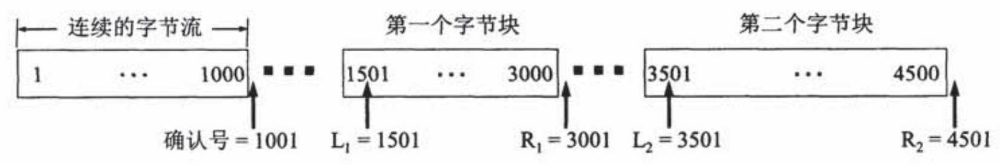

首部选项分配：

1. 指明是SACK选项：1字节
2. 指明这个选项要占用多少字节：1字节
3. 每个边界占4字节，最多四个数据块8个边界，占32字节


### TCP流量控制

#### 工作原理


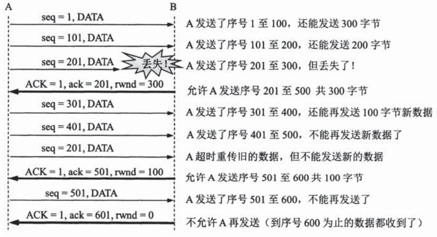

1. 接收方动态控制窗口大小，发送方满足发送窗口不超过接收方给出的接收窗口
2. 如果接收方已满，则rwnd=0，让发送方变为0窗口，此时接收方必须接收零窗口探测报文段、确认报文段、携带紧急数据的报文段
3. 发送方收到零窗口通知，启动计时器，固定间隔发送零窗口探测报文段，接收方确认返回报文给出现在窗口值


#### 传输效率

##### 提高方法

1. TCP维持一个等于最大报文段长度MSS的变量$L$，缓存长度达到$L$，就组装成报文段发送
2. 由发送方应用进程指明要求发送报文段（PUSH）
3. 发送方固定时间把当前缓存数据发送，且保证长度不超过MSS
4. Nagle算法：发送方把第一个字节先发送出去，后面字节缓存，收到第一个字符确认后，再把发送缓存中的所有数据组装成一个报文段发送出去，当数据达到发送窗口一半时，立即发送报文
5. 对交互式的应用进程（每次1个字节就读取），让接收方等待一段时间，缓存有足够空间才发出确认报文，此外，发送方积累足够大的报文再发送


### TCP拥塞控制

#### 特点

流量控制指接收端到发送端两点间通信量控制，发送端速率保证接收端来得及接收即可

拥塞控制是对全局网络负载调整的过程，涉及到所有主机、路由器

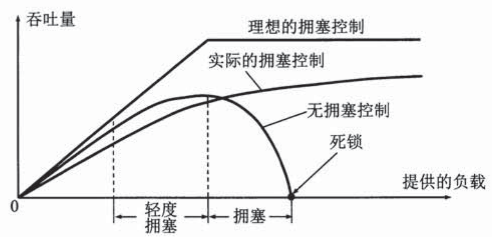

#### 拥塞控制方法
##### 主要思想

1. 发送方让自己的发送窗口等于拥塞窗口（cwnd）：网络没有出现拥塞，则窗口增大；网络出现拥塞或有可能出现拥塞，则窗口减小
   如果结合流量控制的接收方窗口$rwnd$，则发送方窗口上限值 = $min(rwnd,cwnd)$
2. 设置慢开始门限变量（ssthresh）：
   1. $cwnd \lt ssthresh$时，使用慢开始算法
   2. $cwnd \gt ssthresh$时，改用拥塞避免算法
   3. 相等时皆可

3. 发送方没有按时收到应当到达的确认报文，就认为网络出现拥塞，记录当前$cwnd$，设置$ssthresh=\frac{cwnd}{2}$
   实际上，$ssthresh = max(\frac{FlightSize}{2},2 * MSS_{sender})$，FlightSize为当前正在网络中传送的数据量

##### 慢开始算法

$初始cwnd=\begin{cases}
4*MSS_{sender} & MSS_{sender} \leq 1095\\ 
3*MSS_{sender} & 1095 \lt MSS_{sender} \leq 2190\\ 
2*MSS_{sender} & MSS_{sender \geq 2190}
\end{cases}$

$cwnd = cwnd + min(N,MSS_{sender})$

N：最近一次新收到确认的字节数，且重传的字节不算在内

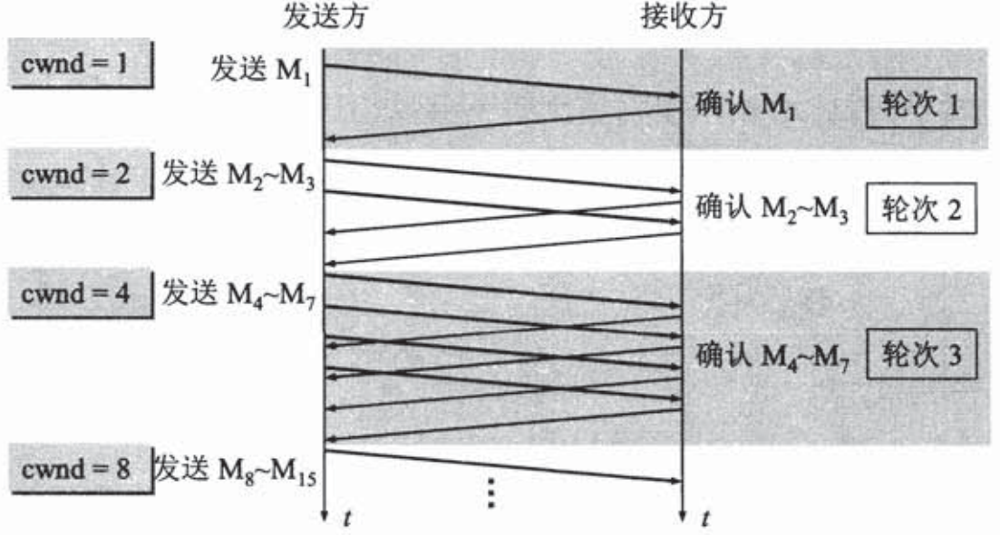


##### 拥塞避免算法

让`cwnd`每经过一个RTT只加`MSS`，按线性规律缓慢增长（实际操作收到一个确认则加$MSS*\frac{MSS}{cwnd}$）

##### 快重传


接收方收到失序报文段立即发出对已收到报文号的确认

发送方连续收到3个重复确认，应当立即进行重传，这样不会超时导致发送方误认为出现网络拥塞


##### 快恢复算法

收到3个重复确认时，发送方设置$ssthresh = \frac{cwnd}{2}, cwnd=ssthresh$，并开始执行拥塞避免算法

有的实现在快恢复开始时cwnd=ssthresh + 3 × MSS。因为3个确认表明有3个分组已经离开网络


##### 具体流程

此算法也成为AIMD算法，AI指拥塞避免阶段，窗口线性增大；MD指超时或3个重复确认，门限值设置为当前拥塞窗口值一半

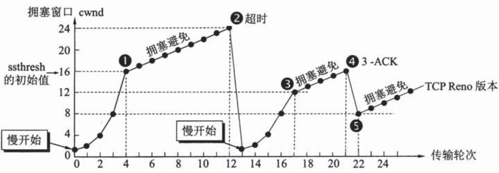

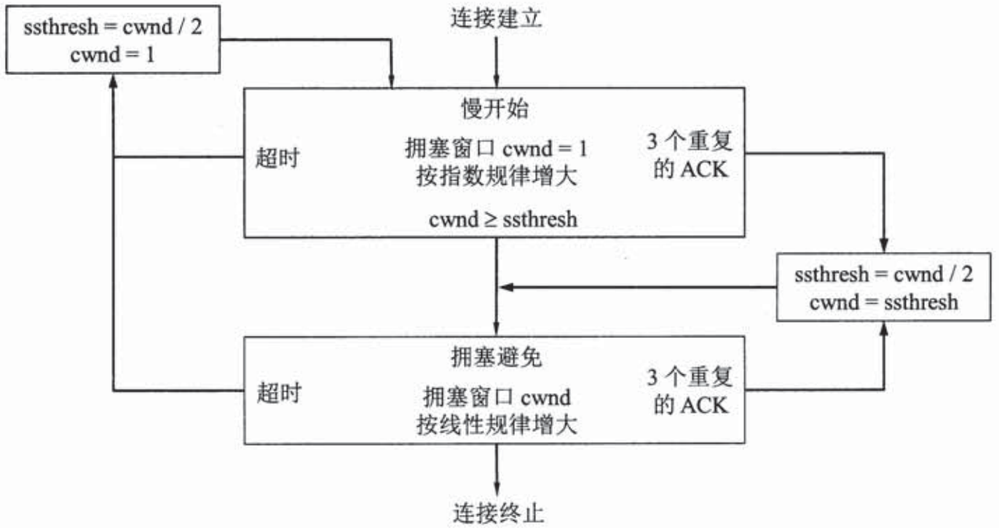


结合流量控制的接收方窗口$rwnd$，则发送方窗口的上限值 = $min(rwnd,cwnd)$


#### 主动队列管理AQM

##### 问题

全局同步：路由器通常采用FIFO队列，队列满之后到达的一连串分组将被丢弃，可能同时影响多条TCP连接，在同一时间进入慢开始状态

全局同步使全网通信量突然下降，在恢复正常后通信量又突然增大

##### 实现

队列长度到某数值（动态）就主动丢弃后面分组，如随机早期检测方法（RED）：设置最小门限$L_{min}$和最大门限$L_{max}$参数，分组到来时检查平均队列长度$q$：

1. $q \lt L_{min}$，则把新到达分组放入队列进行排队
2. $q \gt L_{max}$，则把新到达分组丢弃
3. $L_{min} \leq q \leq L_{max}$，则按照某一丢弃概率p把新到达的分组丢弃


### TCP运输连接管理

#### 建立

##### 工作原理（三报文握手）


假定A是客户程序打开连接，B是服务器程序被动打开连接：

1. 最初两端TCP进程都处于CLOSED状态
2. B创建传输控制块TCB，处于LISTEN状态，等待准备客户连接请求，如有即作出响应
   A创建传输控制块TCB，向B发出连接请求报文，首部中$SYN=1，seq = x$，A进入SYN-SENT状态（$SYN=1$报文不能携带数据，但要占—个序号）
3. B收到连接请求报文段后，同意连接则向A发送确认报文，首部$SYN=1，ACK=1，ack=x＋1，seq=y$，B进入SYN-RCVD状态
4. A收到B确认后，向B发确认报文，首部$ACK=1，ack=y＋1，seq=x+1$，TCP连接此时已建立，A进入ESTABLISHED状态（ACK报文可携带数据，不携带则不占序号，因此$seq = x＋1$）
5. B收到A确认后也进入ESTABLISHED状态

##### 重要问题

###### 已失效的连接请求报文

定义：A发出连接请求在网络滞留，延误到重传请求建立的连接释放后才到达，B误认为A发出一次新连接请求，向A发出确认报文

解决：A对B的确认发送确认，可屏蔽已失效的连接请求报文，B收不到确认可放弃建立连接

###### TCP SYN Flooding攻击

定义：攻击者连续发送大量SYN报文，但不对确认报文做出响应，导致服务器内部数据结构满，无法继续响应其他TCP请求

Linux解决（SYN Cookies）：服务器返回确认时，根据自身特有信息（时间戳、IP地址、端口号等）计算Cookies返回客户端，在收到客户端应答前，不为该连接分配数据结构


#### 释放

##### 工作原理（四报文握手）

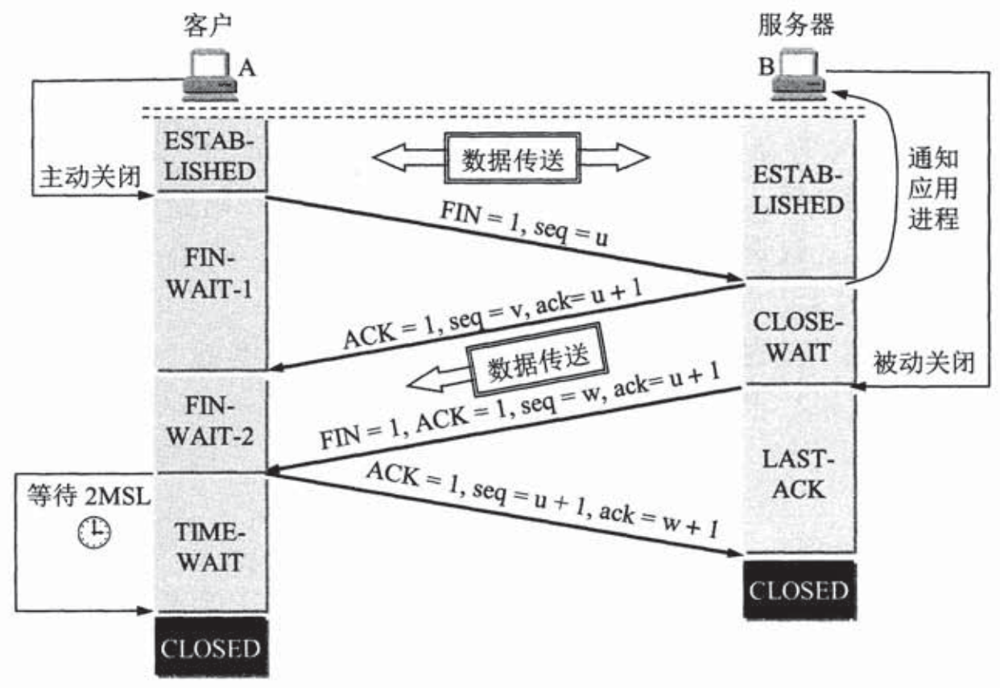

数据传输结束后，通信的双方都可释放连接：

1. A和B都处于ESTABLISHED状态
2. A发出连接释放报文并停止发送数据，首部$FIN=1，seq=u$（$u$为A已传送最后序号+1），A进入FIN-WAIT-1（FIN报文即使不带数据也占一个序号）
3. B收到A报文发出确认，首部$ack=u+1，seq=v$（$v$为B已传送最后序号+1），B进入CLOSE-WAIT状态，通知高层A到B方向关闭，但若B发送数据A仍要接收
4. A收到确认后，进入FIN-WAIT-2状态
5. 若B没有向A发送的数据，B发出连接释放报文，首部$FIN=1,seq=w，ack=u+1$（w为半关闭状态B已传送最后序号+1），B就进入LAST-ACK状态
6. A收到B报文后发出确认，首部中$ACK=1，ack=w+1，seq=u+1$，进入TIME-WAIT状态，此时TCP连接还没释放
7. B收到A确认进入CLOSED状态
   A经过时间等待计时器设置的$2*MSL$后，A进入CLOSED状态

##### 主要问题

###### 最长报文段寿命（$MSL$）

定义：通常设为2分钟，但可以允许更小的值

作用：

1. 保证A最后确认报文段能够到达B：确认报文有可能丢失，B重传FIN+ACK报文，A需要在$2*MSL$内接收并确认重传报文，重启计时器，否则B收不到确认不会进入CLOSED状态
2. 防止已失效连接请求报文：A最后发送确认后，再过$2*MSL$可使本连接产生的所有报文从网络中消失，使已失效连接请求不影响下一个连接

###### 保活计时器：

定义：通常设为2小时

作用：防止连接中的客户端故障使服务器一直等待。

服务器收到客户数据则重新计时，计时结束未收到客户数据则每隔75秒发送探测报文，若连续10个都无响应则关闭连接

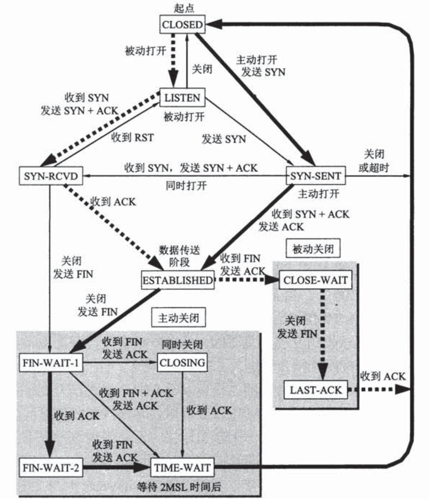


## 第六章 应用层

### 域名系统DNS

#### 特点

1. DNS是联机分布式数据库系统，采用客户服务器方式，待解析域名放入请求报文，IP地址放入回答保温
2. 作用是把便于人们使用的机器名字转换为IP地址
3. 大多数名字在本地解析，仅少量需要在互联网上通信
4. 工作时采用UDP报文，为了减少开销
5. 各级域名由其上一级的域名管理机构管理


#### 结构

采用层次树状结构的命名方法保证唯一性

域：名字空间中一个可被管理的划分，可分为子域，域名由一系列标号组成，标号间用点隔开，级别高在右，总共不超过255字符

标号：由英文字母和数字组成，不超过63个字符，不区分大小写字母，除`-`外不能使用其他标点符号

区：一个DNS服务器实际管辖范围，区内所有节点连通，设置相应的权限域名服务器

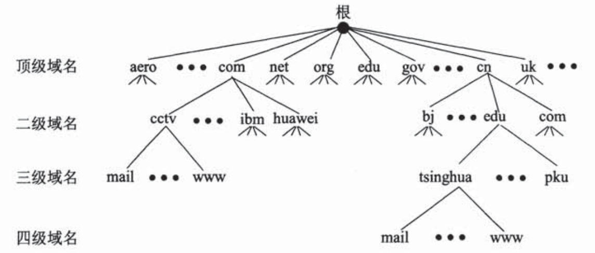

##### 一级域名

1. 国家顶级域名nTLD∶ 如cn、us、uk
2. 通用顶级域名gTLD∶ 如com、net、org、int、edu、gov、mil
3. 基础结构域名(infrastructure domain)∶只有一个，即arpa，用于反向域名解析，因此又称为反向域名

##### 二级域名

我国把二级域名划分为

1. 类别域名：ac、com、edu、gov、mil、net、org
2. 行政区域名：共34个，适用于我国的各省、自治区、直辖市


#### 域名服务器

主域名服务器一般复制副本到辅助域名服务器，多副本保存

服务器类型：

1. 根域名服务器：最高层次域名服务器，存储所有顶级域名服务器域名和IP地址
   所有根域名服务器只使用13个不同 IP 地址的域名，即a.rootservers.net， b.rootservers.net，…，m.rootservers.net
   向根域名服务器查询时采用任播技术，即终点是一组不同地点主机，但具有相同IP地址，IP数据报交付离源点最近的主机
2. 顶级域名服务器：负责管理在该顶级域名服务器注册的所有二级域名
3. 权限域名服务器：每个区的域名服务器，寻找不到时反馈下一步的权限域名服务器
4. 本地域名服务器：主机发出DNS查询请求时，默认发送的服务器，查询主机属于同一ISP则直接转换


#### 工作原理

主机向本地域名服务器的查询一般采用递归查询

本地域名服务器向根域名服务器的查询通常是采用迭代查询，也可以指定为递归查询

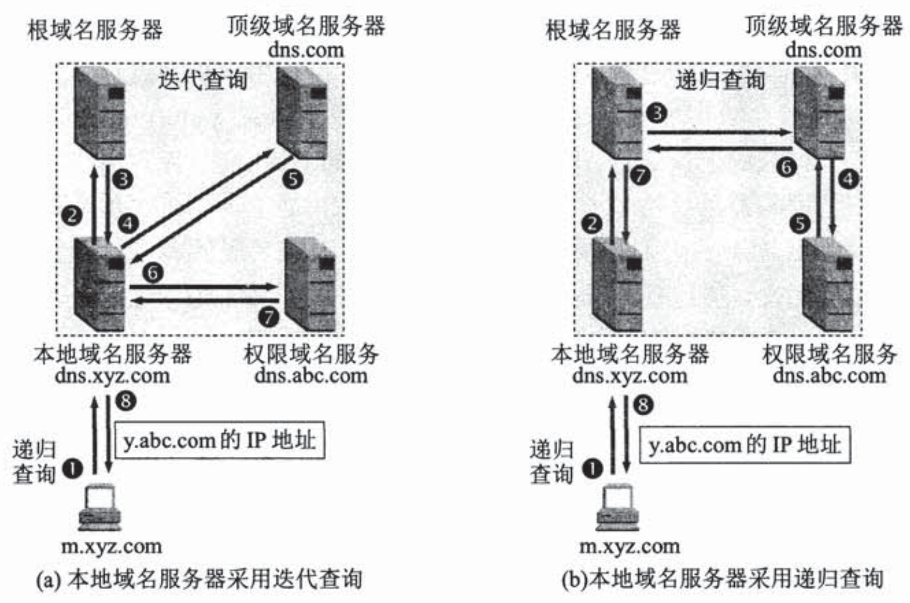

1. 主机`m.xyz.com`向本地域名服务器`dns.xyz.com`进行递归查询
2. 本地域名服务器缓存中没有，采用迭代向根域名服务器查询
3. 根域名返回下一次查询的顶级域名服务器`dns.com`的IP地址
4. 本地域名服务器向`dns.com`进行查询
5. `dns.com`返回下一次查询的权限域名服务器`dns.abc.com`的IP地址
6. 本地域名服务器向`dns.abc.com`进行查询
7. `dns.abc.com`返回所查询的`y.abc.com`的IP地址
8. 本地域名服务器向主机`m.xyz.com`返回`y.abc.com`IP地址，写入缓存

设置高速缓存存放最近查询域名与从何处获得的映射记录、过期时间，减轻根域名服务器负荷，减少DNS报文


### 文件传送协议

#### 文件共享协议概述

1. 提供交互式的访问
2. 允许客户指明文件的类型与格式
3. 允许文件具有存取权限
4. 分为两大类：
   1. 复制文件：存取一个文件，须先获得本地副本，修改文件对文件副本进行修改，再将修改后的文件副本传回原节点，如：FTP基于TCP报文，TFTP基于UDP报文
   2. 联机访问：允许多个程序同时对一个文件存取，由操作系统提供对远地共享文件的透明存取。如：网络文件系统NFS


#### FTP工作原理

服务器主进程∶

1. 打开熟知端口21，等待客户进程发出连接请求
2. 收到客户向21端口的控制连接与客户数据端口$P$，用自己的熟知端口20与$P$建立数据传送连接
3. 并行启动从属进程处理客户进程发来的请求，从属进程自行运行，处理完毕后终止
4. 回到等待状态，继续接受其他客户进程发来的请求

客户进程：

1. 向服务器进程发出端口为21的建立连接请求，同时告诉服务器自己另一个端口号码，用于建立数据传送连接
2. 服务器反馈数据连接和控制连接已建立
3. 客户通过用户界面控制传输，传输完毕断开连接

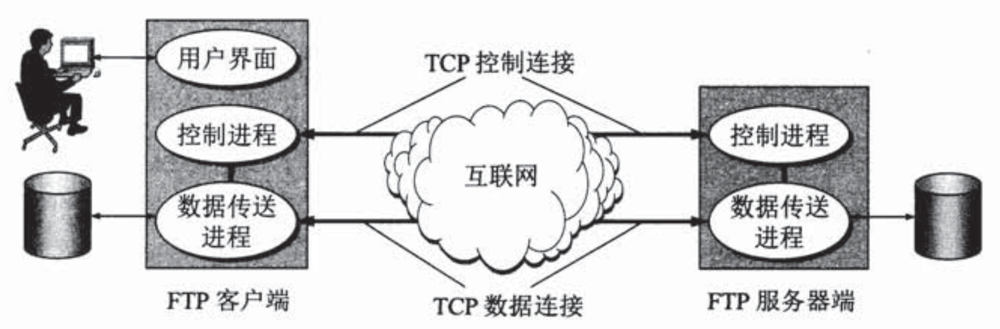

客户和服务器之间的控制与文件传送分开，使用两个并行的TCP连接


#### TFTP

##### 主要特点

1. 使用UDP
2. 运行需要内存较小
3. 每次传送的数据报文中有512字节的数据，但最后一次可不足512字节
4. 数据报文按序编号，从1开始
5. 支持ASCII码或二进制传送
6. 可对文件进行读或写

##### 工作原理

1. 客户进程发送请求报文给服务器进程，熟知端口号码为69，并表明读或写
2. 服务器进程选择新端口和原客户进程通信
3. 客户送完一个文件块后就等待服务器确认
4. 服务器返回确认，指明确认的块编号
5. 客户收到确认发送下一文件块；未收到确认则重发
6. 服务器若规定时间内收不到下一文件块，重发确认
7. 若文件大小恰好为512字节整数倍，传完后发送无数据报文代表结束；否则最后报文数据字段不满512字节可作为结束标志


### TELNET协议

使用户通过TCP连接登录到远程主机上并执行操作，需要知道对方主机名或IP地址

网络虚拟终端NVT：为了屏蔽操作系统差异，传送使用公用的命令行控制信息，到客户或服务器端分别转换为对应系统命令，所有通信使用7位传送数据，最高位为1时用作控制命令，范围不超过ASCII码


### 万维网WWW

#### 概述

1. 主动通过链接获取资源
2. 以客户服务器方式工作
3. 以超文本为基础，实现超媒体系统
4. 分布式系统

#### 统—资源定位符URL

用来表示资源位置和访问资源方法。唯一确定的URL

##### URL格式
$<协议> ://<主机>∶<端口>/<路径>$

1. 协议：获取文档的协议
2. 主机：主机在互联网上域名
3. 端口：可省略
4. 路径：可省略


##### 使用HTTP的URL
HTTP默认端口号80，通常可省略

若再省略文件的<路径>项，则为主页

1. 服务器最高级别页面

2. 某组织部门的定制页面目录

3. 自己设计的描述本人情况的WWW页面


#### HTTP

##### 特点

1. 面向事务，是万维网上能够可靠地交换各种文件重要基础
2. 报文使用TCP连接传送
3. 交换HTTP报文前不需先建立连接
4. 无状态，不记录客户的访问，支持大量并发
5. 每次交互由一个ASCII码串构成的请求和一个类似的通用互联网扩充(类MIME)组成

##### 工作过程

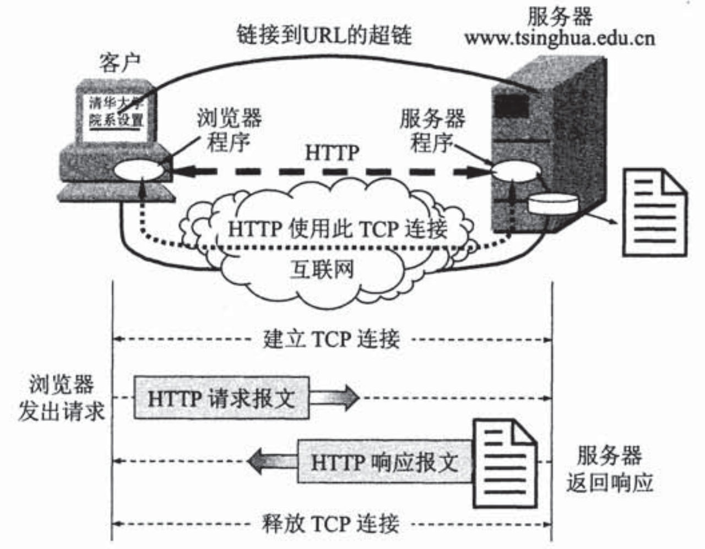

服务器进程：

1. 不断地监听TCP的端口80
2. 一旦监听到连接建立请求，建立了TCP连接
3. 等待客户发出浏览请求，服务器返回响应
4. 完成后释放TCP连接


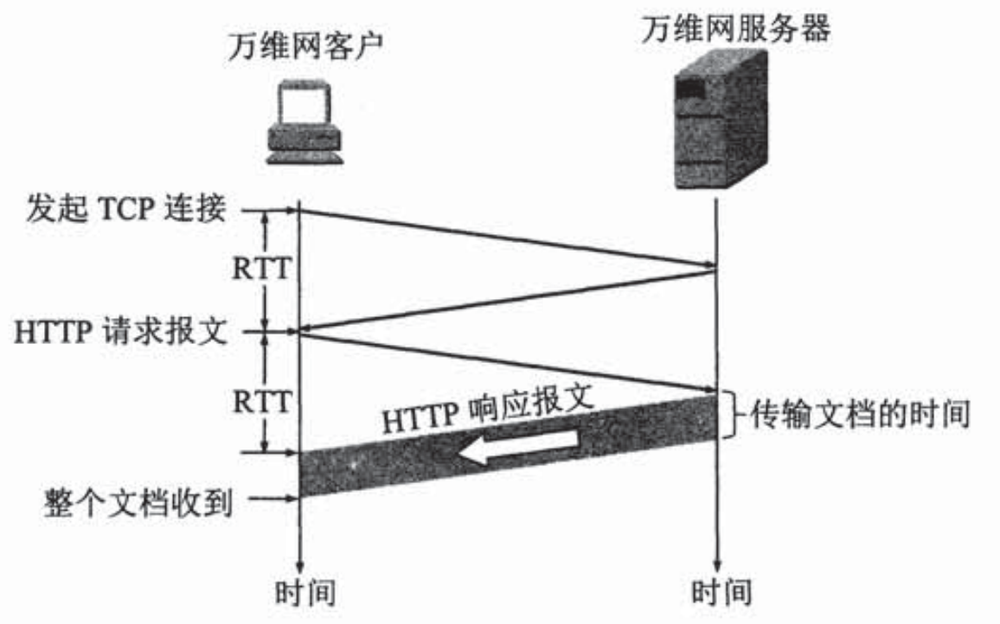

用户进程：

1. 用户点击链接
2. 向服务器发起建立TCP连接并完成前两部分
3. 把HTTP请求报文作为TCP连接第三报文的数据发送
4. 等待服务器回复响应报文

##### 效率

$总时间=文档传输时间+2RTT$

持续连接：服务器发送响应后仍然保持连接，使同一客户传送后续HTTP请求报文

+ 非流水线方式：客户收到前一个响应后才能发出下一个请求，每访问一次对象都要用去一个往返时间 RTT
+ 流水线方式：客户在收到 HTTP 的响应报文之前就能够接着发送新的请求报文，客户访问所有的对象只需花费一个 RTT 时间


##### 代理服务器

代理服务器可在客户端或服务器端工作，也可在中间系统上工作

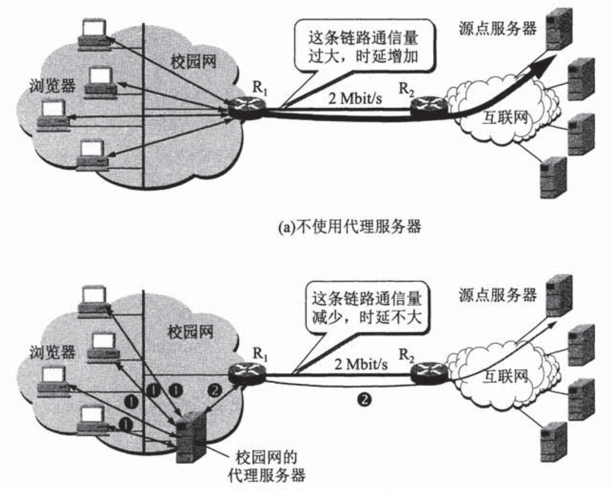

1. 主机向互联网服务器请求服务时，先和代理服务器建立TCP连接并向其发出HTTP请求报文
2. 若代理服务器已经存放请求对象，返回响应报文；否则进入3
3. 代表主机与互联网服务器建立TCP连接并发送HTTP请求报文
4. 代理服务器得到响应报文，复制本地存储器中，再把响应报文返回给主机


##### HTTP报文结构


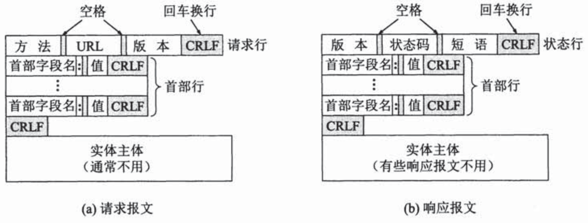

每一个字段都是ASCII码串，长度不确定，用分隔符隔开：

1. 开始行：区分请求报文和响应报文，并携带响应信息
2. 首部行：用来说明浏览器、服务器或报文主体的信息
3. 实体主体

###### 请求报文：

请求方法：

|  方法   |              意义               |
| :-----: | :-----------------------------: |
| OPTION  |        请求一些选项信息         |
|   GET   |   请求读取由 URL 所标志的信息   |
|  HEAD   | 请求读取由URL所标志的信息的首部 |
|  POST   | 给服务器添加信息（例如，注释）  |
|   PUT   |   在指明的 URL 下存储一个文档   |
| DELETE  |   删除指明的 URL 所标志的资源   |
|  TRACE  |   用来进行环回测试的请求报文    |
| CONNECT |         用于代理服务器          |

示例：

``` http
GET /dir/index.htm HTTP/1.1
Host: www.xyz.edu.cn 
Connection: close
User-Agent: Mozilla/5.0
Accept-Language: cn

```


###### 响应报文

状态码：

| 状态码 |           意义           |
| :----: | :----------------------: |
|  1xx   | 请求收到了或正在进行处理 |
|  2xx   |           成功           |
|  3xx   |          重定向          |
|  4xx   |        客户的差错        |
|  5xx   |       服务器的差错       |

示例：


```http
HTTP/1.1 301 Moved Permanently
Location: http://www.xyz.edu/ee/index.html

```


##### 在服务器上存放用户的信息

1. 用户浏览网站发出HTTP请求
2. 网站服务器产生唯一识别码，以此为索引产生项目
3. 在HTTP响应报文中添加`Set-cookie`字段名的首部行，值为识别码
4. 用户收到响应，浏览器在自己的特定Cookie文件添加识别码
5. 用户继续发送HTTP请求，浏览器添加字段名为`Cookie`的首部行，值为识别码


#### WWW文档

##### 超文本标记语言HTML (HyperText Markup Language)

###### 特点

1. 制作万维网页面标准语言
2. 目的是消除不同计算机显示信息障碍
3. 用标签进行排版，用户不能自定义标签，有统一标准

###### 示例

```html
<HTML>
	<HEAD>
		<TITLE>一个HTML的例子</TITLE>
	</HEAD>
	<BODY>
		<H1>HTML 很容易掌握</H1>
		<P>这是第一个段落。</P>
		<P>这是第二个段落。</P>
	</BODY>
</HTML>
```


##### 可扩展标记语言XML (Extensible Markup Language)

###### 特点：

1. 目的是传输数据
2. 使文件具有结构性标记
3. 允许用户自己定义标记
4. 简单、与平台无关


##### 可扩展超文本标记语言XHTML （Extensible HTML）

###### 特点

1. 属于XML应用

2. 更严格的HTML版本

   

##### 层叠样式表 (Cascading Style Sheets)

###### 特点

1. 层叠嵌套样式
2. 用于HTML精确定义布局


##### 动态万维网文档

###### 服务器实现

1. 增加应用程序，处理浏览器发来的数据，创建动态文档
2. 增加机制，使服务器能解释请求中的数据，并转换应用程序的输出为响应数据，返回文档

通用网关接口CGI：一种标准，定义如何创建动态文档、输入数据如何提供给应用程序、如何使用输出结果

CGI程序：在万维网服务器中新增加的应用程序，使用脚本，被另一个程序解释执行

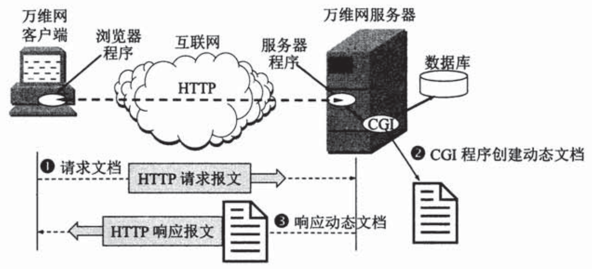

##### 活动万维网文档

目的：用于浏览器屏幕显示连续的更新

###### 服务器推送：

实现：所有工作交给服务器，不断运行动态文档相关联的应用程序，定期更新、发送文档

特点：

1. 服务器推送程序多、内存开销大
2. 维持很多不释放的TCP连接，网络带宽小，传输时延大

###### 活动文档

实现：把所有工作交给用户端，浏览器请求时，服务器返回活动文档程序副本，在浏览器端运行

特点：

1. 用户运行文档程序时，不需服务器，内容可连续改变
2. 服务器上活动文档内容不变，传送时可看做静态文档
3. 本身不能运行，事先在用户端存入运行所需软件

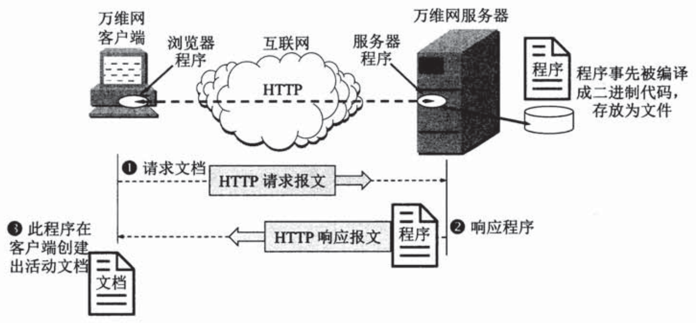


#### 信息检索

##### 全文检索搜索

###### 特点

1. 一种纯技术型的检索工具
2. 工作原理是到互联网上的各网站收集信息，爬取各链接，按照一定规则建立在线索引数据库
3. 用户在查询时只要输入一次关键词
4. 搜索结果过多，内容可能过时

###### Google搜索技术

1. 利用在互联网上相互链接的计算机快速查找每个搜索的答案
2. 可同时进行许多运算
3. 核心技术是PageRank


##### 分类目录搜索

###### 特点

1. 不主动采集网站信息，网站向搜索引擎提交关键词和描述，经过人工审核后输入到分类目录的数据库中
2. 用户按照目录分类逐级查询信息，不使用关键词
3. 查找出的内容有限


##### 垂直搜索引擎（Vertical Search Engine）

###### 特点

1. 针对某一特定领域、人群、需求提供搜索服务，在某行业知识背景中给出结果
2. 用户输入关键字搜索
##### 元搜索引擎（Meta Search Engine）

###### 特点

1. 工作原理是把用户检索请求发到多个独立搜索引擎上去搜索，集中处理结果并返回客户
2. 提高搜索速度
3. 智能化处理搜索结果
4. 个性化搜索功能
5. 用户检索界面友好
6. 查全率和查准率较高


#### 博客

成本低，技术简单，使网民不仅是互联网上内容的消费者，而且还是互联网上内容的生产者

#### 微博

互动传播快，实时性强，技术要求低

#### 社交网站

 功能丰富


### 电子邮件

#### 特点

可满足非实时通信，成本低

#### 组成构件

1. 用户代理
2. 邮件服务器
3. 邮件发送协议（如SMTP）
4. 邮件读取协议（如POP3）

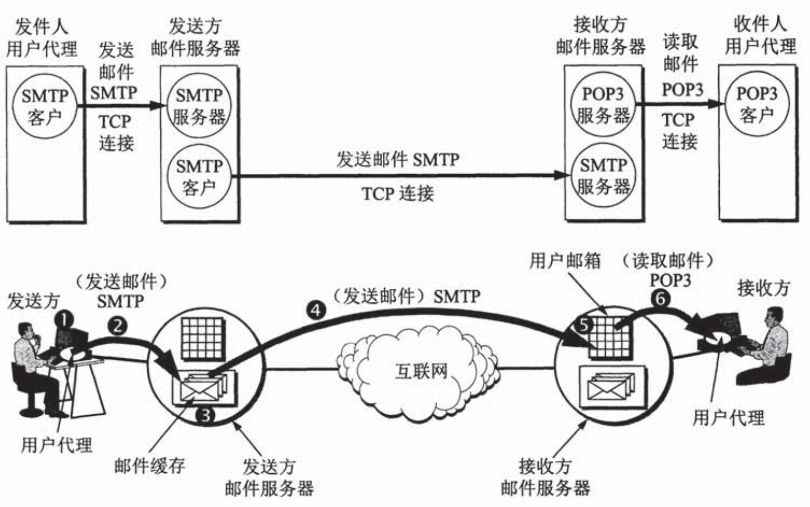

1. 发件人调用用户代理编辑邮件
2. 用户代理用SMTP协议发送邮件到发送方邮件服务器，用户代理充当SMTP客户，而发送方邮件服务器充当SMTP服务器
3. 发送方服务器收到邮件后，临时存放在缓存队列，等待发送
4. 发送方的SMTP客户与接收方的SMTP服务器建立TCP连接，发送缓存队列中到此接收方的邮件，如果超时未发送则通知用户代理
5. 接收方服务器收到邮件后，把邮件放入收件人用户邮箱，等待收件人读取
6. 收件人运行用户代理，使用读取协议主动读取邮件

#### 用户代理

用户与电子邮件系统的接口，即客户端程序，具有功能：

1. 撰写：给用户提供已有信息、可快速编辑信件的环境
2. 显示：在屏幕上显示出来信及具体内容
3. 处理：发送、转发、接收、拦截、删除、保存邮件
4. 通信：利用发送协议和读取协议与邮件服务器通信
#### 邮件服务器
1. 24小时不间断地工作
2. 大容量
3. 可发送、接收邮件，向发件人报告邮件传送的结果
4. 在于客户通信中需要同时使用发送协议和读取协议
5. 在邮件服务器互相通信中同时充当客户和服务器


#### 简单邮件传送协议 SMTP

##### 特点

1. 用命令和应答信息规定如何交换信息，不规定存储和邮件内部格式
   1. 命令：共14种，由几个字母组成
   2. 应答信息：共21种，由3位数字开始的一行字符
2. 使用客户服务器方式
3. 不使用中间的邮件服务器

##### 连接建立
1. 邮件服务器的SMTP客户固定时间扫描缓存，如有邮件，使用SMTP的熟知端口号码25与接收方SMTP服务器建立TCP连接
2. 连接建立后，接收方SMTP服务器要发出`220 Servics ready`
3. 客户向服务器发送`HELO`命令，附上发送方主机名
4. 服务器若有能力接收邮件，则回答`250 OK`；若不可用，则回答`421 Service not available`
5. 发送超时会通知发件人


##### 邮件传送

1. 客户向服务器发送`MAIL`命令，附上发件人地址
2. 若服务器准备好，则回答`250 OK`；否则返回代码，指出原因
3. 客户对每个收件地址发送`RCPT`命令
4. 服务器对每个`RCPT`返回成功或错误码
5. 客户发送`DATA`命令
6. 服务器若能接收返回`354 Start mail input; end with <CRLF>.<CRLF>`；若不能接收邮件，则返回错误命令
7. 客户发送邮件的内容，完毕时发送`<CRLF>.<CRLF>`
8. 服务器对邮件接收返回正确或错误信息


##### 连接释放

1. 发送完毕后客户发送`QUIT`命令
2. 服务器返回`221`，释放TCP连接，传送结束


##### ESMTP*

1. 增加客户端的鉴别
2. 服务端接受二进制报文
3. 服务器按受分块传送大报文
4. 发送前检查报文大小
5. 使用安全传输
6. 使用国际化地址


#### 电子邮件的信息格式

##### 信封

1. 收件人的地址：格式为`用户名@邮件服务器域名`，有一个或多个
2. 邮件主题
3. 抄送
4. 发件人地址
5. 日期

##### 内容

邮件内容


#### 邮件读取协议

##### POP3

1. 简单、功能有限
2. 使用客户服务器工作方式
3. 用户输入读取前输入用户名密码
4. 用户读取了邮件就从服务器把邮件删除


##### IMAP

1. 客户服务器方式工作
2. 用户程序与服务器程序建立TCP 连接，用户可以在本机操纵服务器邮箱
3. 客户根据首部预览，需要打开某邮件时才发送数据到用户，附件等也可以需要时再下载

|  操作位置  |            操作内容            |         IMAP         |     POP3     |
| :--------: | :----------------------------: | :------------------: | :----------: |
|   收件箱   |   阅读、标记、移动、删除邮件   | 客户端与邮箱更新同步 | 仅在客户端内 |
|   发件箱   |          保存到已发送          | 客户端与邮箱更新同步 | 仅在客户端内 |
| 创建文件夹 |           新建文件夹           | 客户端与邮箱更新同步 | 仅在客户端内 |
|    草稿    |            保存草稿            | 客户端与邮箱更新同步 | 仅在客户端内 |
| 垃圾文件夹 |   接收并移入垃圾文件夹的邮件   |         支持         |    不支持    |
|  广告邮件  | 接收并移入广告邮件文件夹的邮件 |         支持         |    不支持    |


#### 基于万维网的电子邮件

用浏览器替代用户代理软件

用户浏览器和邮件服务器传送邮件时使用HTTP协议；各邮件服务器之间传送邮件时仍然使用SMTP协议


####  通用互联网邮件扩充 MIME

##### SMTP缺点

1. 不能传送二进制对象
2. 只能7位ASClI码，很难支持各国文字
3. 邮件长度有限
4. 没有完全按照SMTP互联网标准：
   1. 回车、换行的删除和增加
   2. 超过76个字符时的截断或自动换行
   3. 后面多余空格的删除
   4. 将制表符转换为若干个空格

##### MIME实现

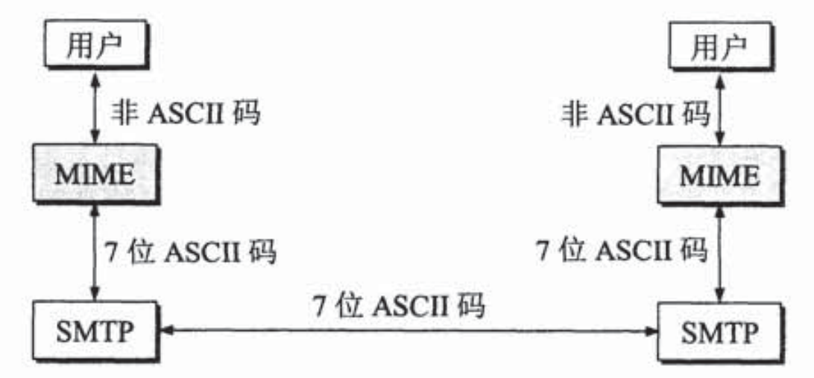

新增5个邮件首部字段：

###### 1. MIME-Version：标志MIME版本

###### 2. Content-Description：说明此邮件主体是否是图像、音频或视频

###### 3. Content-Id：邮件的唯一标识符

###### 4. Content-Transfer-Encoding：在传送时邮件的主体是如何编码的
   1. 7位ASCII 码：每行不超过1000字符，MIME不需进行任何转换
      2. quoted-printable：适用于含有少量非ASCII码
         1. 所有可打印ASCII码（除`=`外）：不改变
         2. 其他：将每字节用两个十六进制数字表示，然后在前面再加上`=`表示转义
      3. base64：
         1. 把二进制代码划分为24位的单元，把每个单元划分为6位的组，每个组共有64种值，用`A-Za-z0-9​+/`按顺序表示
         2. 用`==`表示最后一组为8位
         3. `=`表示最后一组为16位
         4. 回车和换行都忽略
###### 5. Content-Type：说明邮件主体的数据类型和子类型

格式为`内容类型/子类型`

允许发件人和收件人定义专用内容类型，名字要以字符串`X-`开始

|  内容类型   |              子类型举例              |          说明          |
| :---------: | :----------------------------------: | :--------------------: |
|    text     |        plain，html，xml，css         |     不同格式的文本     |
|    image    |            gif，jpeg，tif            |   不同格式的静止图像   |
|    audio    |           basic，mpeg，mp4           |      可听见的声音      |
|    video    |         mpeg，mp4，quicktime         |     不同格式的影片     |
|    model    |                 vrml                 |         3D模型         |
| application |  octet-stream，pdf，javascript，zip  | 不同应用程序产生的数据 |
|   message   |             http，rfc822             |       封装的报文       |
|  multipart  | mixed，alternative，parallel，digest |     多种类型的组合     |

**内容类型multipart**：

1. mixed子类型：允许单个报文含有多个相互独立的子报文，每个子报文可有自己的类型和编码（如图片、音频）
   关键字：用`Boundary=X`定义分隔报文各部分所用字符串`X`，以`--`开始，后面紧跟`X`表示下面开始另一子报文
2. alternative子类型：允许单个报文含有同一数据的多种表示，让使用不同硬件、软件的收件人选择合适形式查看邮件
3. parallel子类型：允许单个报文含有可同时显示的各个子部分（例如图像和声音一起播放）
4. digest子类型：允许单个报文含有一组其他报文（例如收集电子邮件报文）


##### 示例

   ```http
   From: xiexiren@tsinghua.org.cn
   To: xyz@163.com
   MIME-Version: 1.0
   Content-Type: multipart/mixed; boundary=qwertyuiop
   
   --qwertyuiop
   XYZ:
   	你要的图片在此邮件中，收到后请回信。
   														谢希仁
   --qwertyuiop
   Content-Type: image/gif
   Content-Transfer-Encoding: base64
   				{图像数据}
   --qwertyuiop--
   ```

   

### 动态主机配置协议DHCP

#### 特点

1. 即插即用联网
2. 自动配置
3. 给运行服务器软件、位置固定的计算机指派永久地址
4. 使用客户服务器方式
5. 采用UDP报文，服务器端口号67，客户端口号68

##### 工作原理

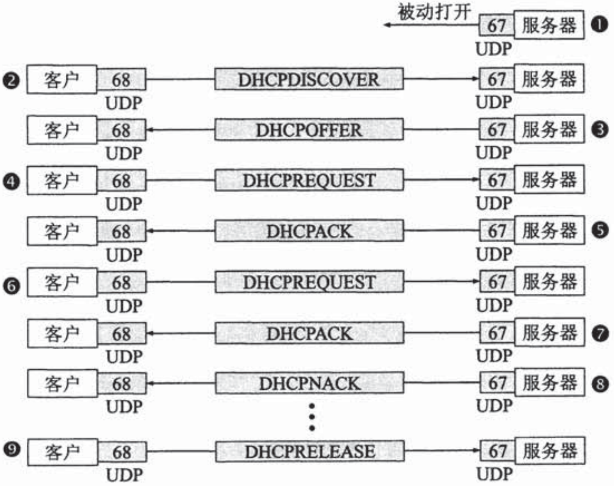

1. 服务器被动打开 UDP 端口67，等待客户端发来报文
2. 客户主机广播发送`DHCPDISCOVER`报文，源IP地址全0，目的IP地址全1
3. 服务器收到后，若查找到已有配置则返回此结果，未找到则生成新配置，将包括租用期$T$的所有配置放入`DHCPOFFER`报文回应
4. 客户从所有`DHCPOFFER`中选择一个服务器，发送`DHCPREQUEST`报文
5. 被选择的服务器发送确认报文`DHCPACK`，表示已经完成绑定，IP地址可以使用，客户设置计时器$T_1=0.5T$和$T_2=0.875T$
6. $T1$时间到，客户发送`DHCPREQUEST`报文要求更新租用期；服务器若不响应，则在$T_2$时间到时，客户重新发送`DHCPREQUEST`报文
7. 服务器若同意，则发送`DHCPACK`报文，客户收到后重新设置计时器$T_1$和$T_2$
8. 服务器若不同意，则发送`DHCPNACK`报文，客户收到后停用IP地址，回到步骤2重新申请
9. 客户可以向服务器发送`DHCPRELEASE`报文提前终止分配


##### DHCP中继代理

1. 代理服务器已经配置了DHCP服务器的IP地址信息
2. 主机A广播后，中继代理接收并向DHCP服务器单播转发报文
3. 中继代理收到DHCP服务器回答报文后，发回给主机A

可以减少DHCP服务器数量

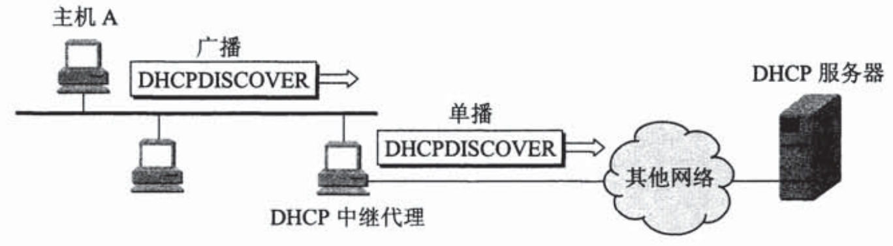


### 简单网络管理协议SNMP

#### 基本概念

虽然网络管理还没有精确定义，但它的内容可归纳为∶
网络管理包括对硬件、软件和人力的使用、综合与协调，以便对网络资源进行监视、测试，配置、分析、评价和控制。这样就能以合理的价格满足网络的—些需求。如实时运行性能、服务质量等。网络管理常简称为网管。
我们可以看到，网络管理并不是指对网络进行行政上的管理。
网络是一个非常复杂的分布式系统。这是因为网络上有很多不同厂家生产的、运行着多种协议的结点（主要是路由器），而这些结点还在相互通信和交换信息。网络的状态总是不断地变化着。可见，我们必须使用一种机制来读取这些结点上的状态信息，有时还要把一些新的状态信息写入到这些结点上。
下面简单介绍网络管理模型中的主要构件（见图 6-21）。
管理站又称为管理器，是整个网络管理系统的核心，它通常是个有着良好图形界面的高性能的工作站，并由网络管理员直接操作和控制。所有向被管设备发送的命令都是从管理站发出的。管理站的所在部门也常称为网络运行中心 NOC （Network Operations Center）。管理站中的关键构件是管理程序（如图 6-21 中有字母 M 的椭圆形图标所示）。管理程序在运行时就成为管理进程。管理站（硬件）或管理程序（软件）都可称为管理者（manager）或管理器，所以这里的 manager 不是指人而是指机器或软件。网络管理员（administrator）才是指人。大型网络往往实行多级管理，因而有多个管理者，而一个管理者一般只管理本地网络的设备。


在被管网络中有很多的被管设备（包括设备中的软件）。被管设备可以是主机、路由器、打印机、集线器、网桥或调制解调器等。在每一个被管设备中可能有许多被管对象（Managed Object）。被管对象可以是被管设备中的某个硬件（例如，一块网络接口卡），也可以是某些硬件或软件（例如，路由选择协议）的配置参数的集合。被管设备有时可称为网络元素或简称为网元。在被管设备中也会有一些不能被管的对象（在下面的 6.7.2 节将会讲到对象命名树，所谓不能被管的对象就是不在对象命名树上的对象）。
在每一个被管设备中都要运行一个程序以便和管理站中的管理程序进行通信。这些运行着的程序叫做网络管理代理程序，或简称为代理（agent）（如图 6-22 中有字母 A 的几个椭圆形图标所示）。代理程序在管理程序的命令和控制下，在被管设备上采取本地的行动。
在图 6-22 中还有一个重要构件就是网络管理协议，简称为网管协议。后面还要讨论它的作用。
简单网络管理协议 SNMP （Simple Network Management Protocol）中的管理程序和代理程序按客户服务器方式工作。管理程序运行 SNMP 客户程序，而代理程序运行 SNMP 服务器程序。在被管对象上运行的 SNMP 服务器程序不停地监听来自管理站的 SNMP 客户程序的请求（或命令）。一旦发现了，就立即返回管理站所需的信息，或执行某个动作（例如，把某个参数的设置进行更新）。在网管系统中往往是一个（或少数几个）客户程序与很多的服务器程序进行交互。
关于网络管理有一个基本原理，这就是∶
若要管理某个对象，就必然会给该对象添加一些软件或硬件，但这种"添加"对原有对象的影响必须尽量小些。
SNMP 正是按照这样的基本原理来设计的。
SNMP 发布于 1988 年。OSI 虽然在这之前就已制定出许多的网络管理标准，但当时（到现在也很少）却没有符合 OSI 网管标准的产品。SNMP 最重要的指导思想就是要尽可能简单。SNMP 的基本功能包括监视网络性能、检测分析网络差错和配置网络设备等。在网络正常工作时，SNMP 可实现统计、配置和测试等功能。当网络出故障时，可实现各种差错检测和恢复功能。经过近二十年的使用，SNMP 不断修订完善，较新的版本是 SNMPy3，而前两个版本分别是 SNMPv2 和 SNMPvl。但一般可简称为 SNMP。现在 SNMPv3 已成为互联网标准（STD 62）。SNMPv3 最大的改进就是安全特性。也就是说，只有被授权的人员才有资格执行网络管理的功能（如关闭某一条链路）和读取有关网络管理的信息（如读取一个配置文件的内容）。然而 SNMP 协议已相当庞大，一点也不"简单"，整个标准共有八个 RFC 文档【RFC 3411～3418】。因此这里只能给出一些最基本的概念。
若网络元素使用的不是 SNMP 协议而是另一种网络管理协议，那么 SNMP 协议就无法控制该网络元素。这时可使用委托代理（proxy agent）。委托代理能提供如协议转换和过滤操作等功能对被管对象进行管理。
SNMP 的网络管理由三个部分组成，即 SNMP 本身、管理信息结构 SMI （Structure of Management Information）和管理信息库 MIB （Management Information Base）。下面简述这三部分的作用。
SNMP 定义了管理站和代理之间所交换的分组格式。所交换的分组包含各代理中的对象（变量）名及其状态（值）。SNMP 负责读取和改变这些数值。
SMI 定义了命名对象和定义对象类型（包括范围和长度）的通用规则，以及把对象和对象的值进行编码的规则。这样做是为了确保网络管理数据的语法和语义无二义性。但从 SMI 的名称并不能看出它的功能。请注意，SMI 并不定义—个实体应管理的对象数目，也不定义被管对象名以及对象名及其值之间的关联。
MIB 在被管理的实体中创建了命名对象，并规定了其类型。
为了更好地理解上述的几个组成部分，可以把它们和程序设计进行一下对比。
我们在编程时要使用某种语言，而这种语言就是用来定义编程的规则。例如，一个变量名必须从字母开始而后面接着是字母数字。在网络管理中，这些规则由 SMI 来定义。在程序设计中必须对变量进行说明。例如，int counter，表示变量 counter 是整数类型。 MIB 在网络管理中就做这样的事情。MIB 给每个对象命名，并定义对象的类型。
在编程中的说明语句之后，程序需要写出一些语句用来存储变量的值，并在需要时改变这些变量的值。SNMP 在网络管理中完成这件任务。SNMP 按照 SMI 定义的规则，存储、改变和解释这些已由 MIB 说明的对象的值。
总之，SMI 建立规则，MIB 对变量进行说明，而 SNMP完成网管的动作。


#### 管理信息结构MSI

管理信息结构 SMI 是 SNMP 的重要组成部分。根据 6.7.1 节所讲的，SMI 的功能应当有三个，即规定∶
（1）被管对象应怎样命名;
（2）用来存储被管对象的数据类型有哪些;（3）在网络上传送的管理数据应如何编码。 

##### 被管对象的命名

SMI规定，所有的被管对象都必须处在对象命名树（object naming tree）上。图6-22 给出了对象命名树的一部分。对象命名树的根没有名字，它的下面有三个顶级对象，都是世界上著名的标准制定单位，即 ITU-T（过去叫做 CCITT），ISO，以及这两个组织的联合体，它们的标号分别是0到2。图中的对象名习惯上用英文小写表示。在 ISO 的下面的一个标号为 3 的节点是 ISO 认同的的组织成员 org。在其下面有一个美国国防部 dod （Department of Defense）的子树（标号为 6），再下面就是 internet（标号为 1）。在只讨论 interet 中的对象时，可只画出 internet 以下的子树，并在 internet 节点旁边写上对象标识符1.3.6.1 即可。


在 internet 节点下面的标号为 2 的节点是 mgmt（管理）。再下面只有一个节点，即管理信息库 mib-2，其对象标识符为 1.3.6.1.2.1。在 mib-2 下面包含了所有被 SNMP 管理的对象（见下面6.7.3节的讨论）。


##### 被管对象的数据类型

SMI 使用基本的抽象语法记法 1 （即 ISO 制定的 ASN.1"）来定义数据类型，但又增加了一些新的定义。因此 SMI 既是 ASN，1 的子集，又是 ASN.1 的超集。ASN.1 的记法很严格，它使得数据的含义不存在任何可能的二义性。例如，使用 ASN.1 时不能简单地说"一个，具有整数值的变量"，而必须说明该变量的准确格式和整数取值的范围。当网络中的计算机对数据项并不都使用相同的表示时，采用这种精确的记法就尤其重要。
我们知道，任何数据都具有两种重要的属性，即值（value）与类型（type）。这里"值" 是某个值集合中的一个元素，而"类型"则是值集合的名字。如果给定一种类型，则这种类型的一个值就是该类型的一个具体实例。
SMI 把数据类型分为两大类∶简单类型和结构化类型。简单类型是最基本的、直接使用 ASN.1定义的类型。表 6-4 给出了最主要的几种简单类型。

|       类型        | 大小  |                    说明                     |
| :---------------: | :---: | :-----------------------------------------: |
|      INTEGER      | 4字节 |        在$[-2^{31},2^{31}-1]$的整数         |
|    Interger32     | 4字节 |                和INTEGER相同                |
|     Unsiged32     | 4字节 |         在$[0,2^{32}-1]$的无符号数          |
|   OCTET STRING    | 可变  |          不超过65535字节长的字节串          |
| OBJECT IDENTIFIER | 可变  |                 对象标识符                  |
|     IPAddress     | 4字节 |                   IP 地址                   |
|     Counter32     | 4字节 |       可在$[0,2^{32})$循环增加的整数        |
|     TimeTicks     | 4字节 | 记录时间的计数值，以$\frac{1}{100}$秒为单位 |
|       BITS        |   -   |                   比特串                    |
|      Opaque       | 可变  |                 不解释的串                  |

SMI定义了两种结构化数据类型，即 sequence 和 sequence of。
数据类型 sequence 类似于 C 语言中的 struct 或 record，它是一些简单数据类型的组合（不一定要相同的类型）。而数据类型 sequence of 类似于C 语言中的 array，它是同样类型的简单数据类型的组合，或同样类型的 sequence 数据类型的组合。


##### 编码方法

SMI使用 ASN.1 制定的基本编码规则 BER （Basic Encoding Rule）进行数据的编码。BER指明了每种数据的类型和值。在发送端用 BER 编码，可把用 ASN.1 所表述的报文转换成唯一的比特序列。在接收端用 BER 进行解码，就可得到该比特序列所表示的 ASN.1 报文。初看起来，或许用两个字段就能表示类型和值。但由于表示值可能需要多个字节，因此还需要一个指出"要用多少字节表示值"的长度字段。因此 ASN.1 把所有的数据元素都表示为 T-L-V 三个字段组成的序列（见图 6-23）。T 字段（Tag）定义数据的类型，L 字段（Length）定义V字段的长度，而V 字段（Value）定义数据的值。

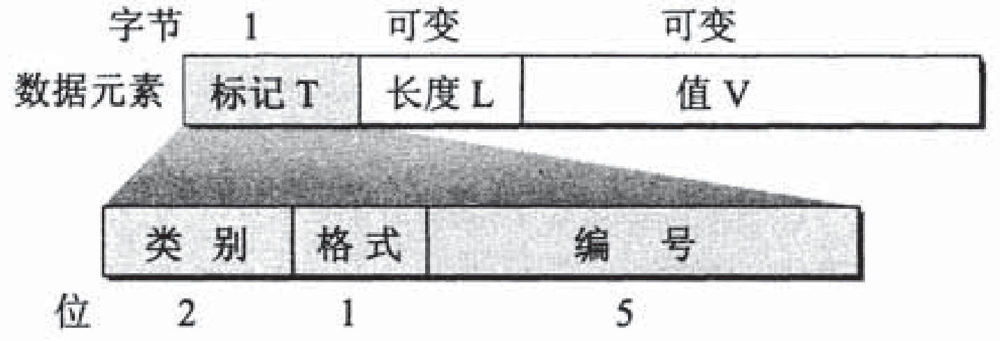

（1）T 字段又叫做标记字段，占 1 字节。T 字段比较复杂，因为它要定 义的数据类型较多。T字段又再分为以下三个子字段∶

类别（2 位）共四种∶通用类（00），即 ASN.1 定义的类型;应用类（O1），即 SMI 定义的类型; 上下文类（10），即上下文所定义的类型;专用类（11），保留为特定厂商定义的类型。

格式（1 位）共两种，指出数据类型的种类∶ 简单数据类型（0），结构化数据类型(1)

编号（5 位）用来标志不同的数据类型。编号的范围一般为0～30。当编号大于 30时，T 字段就要扩展为多个字节（这种情况很少用到，可参考 ITU-T X.209，这里从略）。
表 6-5是一些数据类型的 T 字段的编码。


（2）L字段又叫做长度字段（单字节或多字节）。当 L 字段为单字节时，其最高位为 0，后面的 7 位定义 V 字段的长度。当L 字段为多个字节时，其最高位为 1，而后面的 7 位定义后续字节的字节数（用二进制整数表示）。这时，所有的后续字节并置起来的二进制整数定义V字段的长度

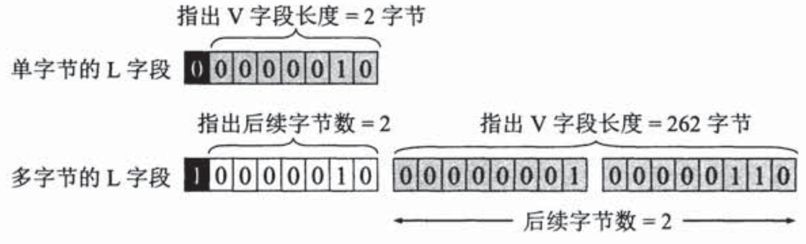

（3） V 字段又叫做值字段，用于定义数据元素的值。
根据以上所述，我们给出两个用十六进制表示的编码例子。例如，INTEGER 15，根据表 6-5，其 T字段是 02，再根据表 6-4，INTEGER类型要用4字节编码。最后得出 TLV 编码为02 04 00 00 00 OF。又如IPAddress 192.1.2.3，IPAddress 的T字段是40，V字段需要4字节表示，因此IPAddress 192.1.2.3 的 TLV 编码是 40 04 C0 01 02 03。
TLV 方法中的 V 字段还可嵌套其他数据元素的 TLV 字段，并可多重嵌套。


#### 管理信息库MIB

所谓"管理信息"就是指在互联网的网管框架中被管对象的集合。被管对象必须维持可供管理程序读写的若干控制和状态信息。这些被管对象构成了一个虚拟的信息存储器，所以才称为管理信息库 MIB。管理程序就使用 MIB 中这些信息的值对网络进行管理（如读取或重新设置这些值）。只有在 MIB 中的对象才是 SNMP 所能够管理的。例如，路由器应当维持各网络接口的状态、入分组和出分组的流量、丢弃的分组和有差错的报文的统计信息，而调制解调器则应当维持发送和接收的字符数、码元传输速率和接受的呼叫等统计信息。因此在 MIB中就必须有上面这样一些信息。
我们再看一下图 6-22，可以找到节点 mib-2 下面的部分是 MIB 子树。表 6-6 给出了节点mib-2 所包含的前八个信息类别代表的意思（在后面还有好几个类别）。


我们可以用个简单例子进一步说明 MIB 的意义。例如，从图 6-22 可以看出，对象 ip的标号是 4。因此，所有与 IP有关的对象都从前缀 1.3.6.1.2.1.4开始。
（1）在节点 ip下面有个名为 ipInReceives 的 MIB 变量（见图 6-22），表示收到的 IP 数据报数。这个变量的标号是 3，变量的名字是∶ iso.org.dod.internet.mgmt.mib.ip.ipInReceives，而相应的数值表示是∶1.3.6.1.2.1.4.3。
（2）当 SNMP 在报文中使用 MIB 变量时，对于简单类型的变量，后缀 0 指具有该名字的变量的实例。因此，当这个变量出现在发送给路由器的报文中时，iplInReceives 的数值表示（即变量的一个实例）就是∶ 1.3.6.1.2.1.4.3.0。
（3）请注意，对于分配给一个 MIB 变量的数值或后缀是完全没有办法进行推算的，必须查找已发布的标准。
上面所说的 MIB 对象命名树的大小并没有限制。下面给出若干 MIB 变量的例子（见表 6-7），以便更好地理解MIB 的意义。这里的"变量"是指特定对象的一个实例。


上面列举的大多数项目的值可用一个整数来表示。但 MIB 也定义了更复杂的结构。例如，MIB 变量 ipRoutingTable 则定义一个完整的路由表。还有其他一些 MIB 变量定义了路由表项目的内容，并允许网络管理协议访问路由器中的单个项目，包括前缀、地址掩码以及下一跳地址等。当然，MIB 变量只给出了每个数据项的逻辑定义，而一个路由器使用的内部数据结构可能与 MIB 的定义不同。当一个查询到达路由器时，路由器上的代理软件负责 MIB 变量和路由器用于存储信息的数据结构之间的映射。


#### SNMP 的协议数据单元和报文

实际上，SNMP 的操作只有两种基本的管理功能，即∶（1）"读"操作，用 Get 报文来检测各被管对象的状况;（2）""写"操作，用 Set 报文来改变各被管对象的状况。
SNMP 的这些功能通过探询操作来实现，即 SNMP 管理进程定时向被管理设备周期性地发送探询信息。上述时间间隔可通过 SNMP 的管理信息库 MIB 来建立。探询的好处是∶第一，可使系统相对简单;第二，能限制通过网络所产生的管理信息的通信量。但探询管理协议不够灵活，而且所能管理的设备数目不能太多。探询系统的开销也较大。如探询频繁而
并未得到有用的报告，则通信线路和计算机的 CPU 周期就被浪费了。
但 SNMP 不是完全的探询协议，它允许不经过询问就能发送某些信息。这种信息称为陷阱（trap），表示它能够捕捉"事件"。但这种陷阱信息的参数是受限制的。
当被管对象的代理检测到有事件发生时，就检查其门限值。代理只向管理进程报告达到某些门限值的事件（这就叫做过滤）。这种方法的好处是∶第一，仅在严重事件发生时才发送陷阱; 第二，陷阱信息很简单且所需字节数很少。
总之，使用探询（至少是周期性地）以维持对网络资源的实时监视，同时也采用陷阱机制报告特殊事件，使得 SNMP 成为一种有效的网络管理协议。
SNMP 使用无连接的 UDP，因此在网络上传送 SNMP 报文的开销较小。但 UDP 是不保证可靠交付的。这里还要指出，SNMP 使用 UDP 的方法有些特殊。在运行代理程序的服务器端用熟知端口 161来接收 Get 或 Set 报文和发送响应报文（与熟知端口通信的客户端使用临时端口），但运行管理程序的客户端则使用熟知端口 162 来接收来自各代理的 trap 报文。
SNMP 现在共定义了如表 6-8 所示的8种类型的协议数据单元【RFC 3416】，其中 PDU编号为4的已经废弃了。在 PDU 编号后面是对应的T字段值（十六进制表示）


和大多数 TCP/IP 协议不一样，SNMP 报文没有固定的字段。相反，它们使用标准 ASN.1 编码。因此，SNMP 报文用人工进行编码和理解时都比较困难。为此，在图 6-25 中给出了 SNMPv1 的报文格式。可以看出，一个 SNMP 报文共由四个部分组成，即版本、首部、安全参数和 SNMP 报文的数据部分。版本现在已是版本 3。首部包括报文标识（message identification）、最大报文长度、报文标志（message flag）。报文标志占 1 字节，其中的每一位定义安全类型或其他信息。安全参数用来产生报文摘要（见下一章的 7.4 节）。
从图 6-25 可看出，在 SNMP PDU 前面还有两个有关加密信息的字段。这是当数据部分需要加密时才使用的两个字段。与网络管理直接相关的是后面的 SNMP PDU 部分。对于表 6-8 给出的前四种 PDU 的格式都是相同的，即由 PDU 类型、请求 ID、差错状态、差错索引以及变量绑定这几个字段组成。PDU 的各种类型以及类型的编号和 T字段的编码已在表 6-8中给出。下面简单介绍一下其他字段的作用。

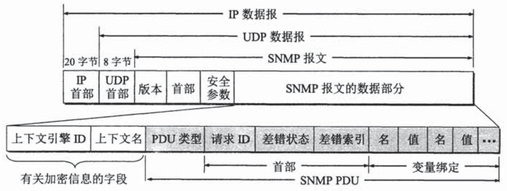

（1）请求标识符（request ID） 由管理进程设置的 4 字节整数值。代理进程在发送响应报文时也要返回此请求标识符。由于管理进程可同时向许多代理发出请求读取变量值的报文，因此设置了请求标识符可使管理进程能够识别返回的响应是对应于哪一个请求报文。（2）差错状态（error status） 在请求报文中，这个字段是零。当代理进程响应时，就填入 0~18 中的一个数字。例如 0 表示 noError（一切正常），1 表示 tooBig（代理无法把回答装入到一个 SNMP 报文之中），2 表示 noSuchName（操作指明了一个不存在的变量），3 表示 badValue （无效值或无效语法），等等【RFC 3416】。

（3）差错索引（error index） 在请求报文中，这个字段是零。当代理进程响应时，若出现 noSuchName，badValue 或 readOnly 的差错，代理进程就设置一个整数，指明有差错的变量在变量列表中的偏移。
（4）变量绑定（variable-bindings） 指明一个或多个变量的名和对应的值。在请求报文中，变量的值应忽略（类型是 NULL）。
为了大致了解 ASN.1 给出的定义的形式，下面举出定义 GetRequest-PDU 的例子。两个连字符"_"后面的是注解。 Get-request-PDU := [0]
-【0】表示上下文类，编号为0 IMPLICTT SEQUENCE {--类型是 SEQUENCE integer32, request.id
-变量 request-id 的类型是 integer32
INTEGER{0.18},
error-status1
--变量 error-status 取值为0～18的整数
INTEGER{0.max-bindings}，--变量 error-index 取值为0～max-bindings 的整数
error-index]
--变量 variable-binding 的类型是 VarBindList variable-bindings VarBindList }
但变量 VarBindList 是什么类型呢?还需要继续定义（这里从略）。上面 ASN.1 定义中的第二行中的 IMPLICIT 叫做隐式标记，是为了在进行编码时可省去对 IMPLICIT 后面的类型（SEQUENCE）的编码，使最后得出的编码更加简洁。
下面我们假定管理者发送 GetRequest-PDU，为的是从某路由器的代理进程获得"收到 UDP 数据报的数目"的信息。从图 6-22可以查出，mib-2 下面第7个节点是 udp，而 udp节点下面的第一个节点就是 udpInDatagrams。由于这个节点已经是叶节点（即没有连接在它下面的子节点了），读取这个节点的数值时应在节点标识符后面加上0，即1.3.1.1.2.1.7.1.0。这样，可得出 GetRequest-PDU 的 ASN.1 编码如图6-26 所示。

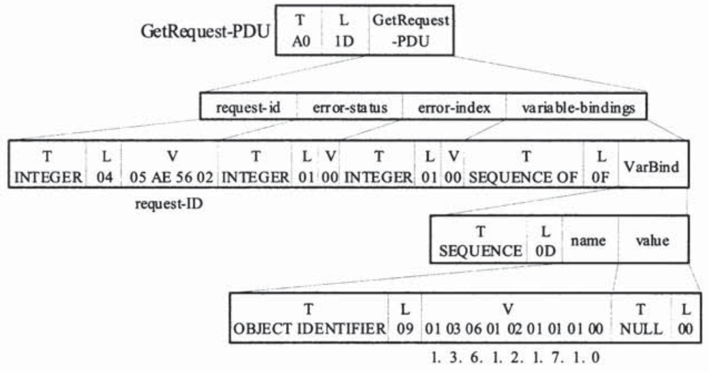

可以把图中各字段的十六进制编码表示如下。-GetRequest-PDU，上下文类型，长度 1Ds=29
A0 1D 02 04 05 AE 56 02
--INTEGER类型，长度04，request-id=05AE 5602--INTEGER类型，长度 0116，error status=006
02 0100 0201 00
-- NTEGER类型，长度 0116，error index=0016
300F
-- SEQUENCE OF 类型，长度 OF，。= 15
30 OD
--SEQUENCE 类型，长度 OD;=13

--OBJECT IDENTIFIER类型，长度09，udpInDatagrams
06 09 01 03 06 01 0201 070100 05 00
- NULL类型，长度 006

### 应用进程跨域网络的通信


## 第九章 无线网络和移动网络

### WLAN

便携站：便于移动，但工作时不移动

移动站：可任意移动

#### 固定基础设施类型

##### 概念

使用星形拓扑结构，中心是接入点AP，MAC层使用CSMA/CA协议，IEEE802.11系列WLAN成为Wi-Fi

802.11系列规定最小构件为基本服务集BSS：包括一个基站AP和若干移动站，所有的站在BSS内可直接通信，和以外的站通信必须经过BSS。所覆盖的范围称为基本服务区BSA

接入点AP：安装AP时需要给其分配不超过32字节的服务集标识符SSID和一个通信信道

分配系统DS：BSS可以通过AP连入DS，然后再连别的BSS，共同构成一个拓展服务集ESS。DS可以使ESS对上层表现像一个BSS一样。ESS中的不同BSS可能有相交部分。DS可以使用以太网（常用），点对点链路，或其他无线网络

门户Portal：相当于网桥，可以为无线局域网用户提供到802.x局域网即其他局域网的接入

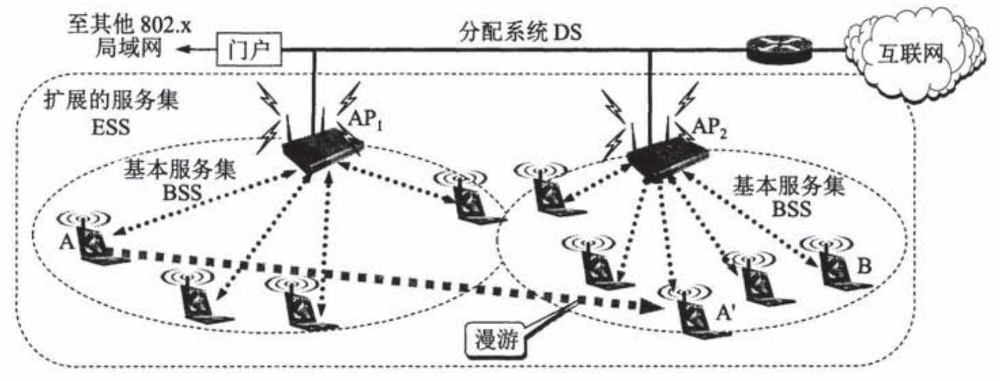

##### 工作流程

1. 工作时移动站先与某AP建立关联，可以等待AP周期性发送信标帧（被动），也可以主动发出探测请求帧，等待AP发回探测响应帧
2. 让AP鉴别自身，再通过AP向该子网发送DHCP发现报文来获取IP地址，此时变成AP子网的一台主机。
3. 重建关联直接关联到另一个AP上，分离可以终止与AP连接


#### 无固定基础设施（移动自组网络）

##### 特点

没有基站，因此服务范围受限，一般不和其他外界网络连接，路由选择协议复杂，多播复杂

##### 无线传感器网络WSN

数据采集处理传输，不需要高带宽，要低功耗，存储受限，对安全、重组要求高，主要在物联网中应用

##### 概念

移动IP是用户以多种方式连接到互联网，仍基于固定互联网的路由选择协议

移动组网有自己的路由选择协议甚至可以不连到互联网，连上也是以残桩网络形式存在

残桩网络：可以发出和接受通信量，但不允许外部通信量穿越残桩网络

1. 固定接入：作为网络用户期间，用户设置地理位置不变
2. 移动接入：用户能够以车辆速度移动时进行网络通信，切换时连续
3. 便携接入：受限网络范围内，能以步行速度进行网络通信，切换时连续
4. 游牧接入：正在进行网络通信时保持位置不变，移动后再次寻找基站


#### 物理层

无线局域网适配器能适配很多标准，有双模三模


#### MAC层协议

##### 802.11使用CSMA/CA协议

无线环境碰撞检测问题：

1. 无线信道信号强度动态范围大，监听到的信号强度太小
2. 无法避免碰撞发生，如ABC为等边三角形，AC隔了一座山，检测不出信道上对方信号，都需要给B发送信号
3. 暴露站问题：ABCD一条线排列，BC想给A和D发送消息，认为产生了碰撞，但实际上并不影响（AD离得很远）
4. 可允许多个移动站之间同时通信

CA：尽量避免碰撞

停止等待协议：发送完一帧后需要等待对方确认帧才继续发下一帧，是链路层确认

##### 802.11的MAC层

MAC设计在物理层上，包括两个子层：

1. 分布协调功能DCF：没有任何控制中心，每个结点使用CSMA机制的分布式接入算法，向上提供争用服务，所有实现必须有DCF
2. 点协调功能：PCF可有可无，用接入点AP来控制整个BSS内的活动，集中控制类似轮询避免碰撞

等待一段帧间间隔IFS后，才能继续发送下一帧，高优先级帧需要时间短，低优先级需要时间长

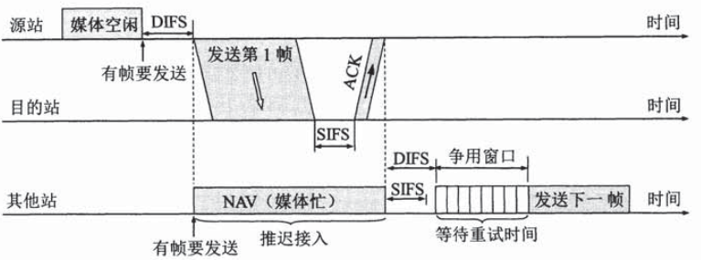

###### 帧间隔类型

1. SIFS：短帧间间隔，28μs，是最短间隔，用来分隔开属于一次对话的各帧。一个站应当能在SIFS内从发送方式切换到接收方式。使用 SIFS 的帧类型有
   1. ACK 帧
   2. CTS 帧
   3. 由过长的 MAC 帧分片后的数据帧
   4. 所有回答 AP 探询的帧
   5. 在 PCF 方式中接入点 AP发
送出的任何帧

2. DIFS：分布协调功能帧间间隔，长度为 128μs。在 DCF 方式中，DIFS 用来发送数据帧和管理帧


### WPAN

